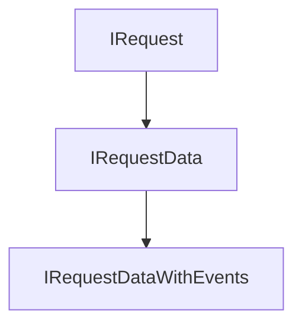

# IRequestDataWithEvents

## Description

The request contents. Returned by [waitForConfirmation()](request/waitforconfirmation.md), [getData()](request/getdata.md) and many other methods.

## Instance Methods

<table data-full-width="true"><thead><tr><th>Name</th><th>Description</th></tr></thead><tbody><tr><td>on()</td><td>Event subscriber</td></tr><tr><td>emit()</td><td>Event emitter</td></tr></tbody></table>

## Inherited Properties

### IRequestData

<table data-full-width="true"><thead><tr><th>Name</th><th>Type</th><th data-type="checkbox">Required?</th><th>Description</th></tr></thead><tbody><tr><td>currency</td><td>string</td><td>true</td><td>The currency in which the request is denominated.</td></tr><tr><td>meta</td><td>IReturnMeta</td><td>false</td><td>Metadata from the layer below (transaction manager), including ignored actions, if any.</td></tr><tr><td>balance</td><td><a href="irequestdatawithevents.md#ibalancewithevents">IBalanceWithEvents</a></td><td>false</td><td>The balance object</td></tr><tr><td>contentData</td><td>object</td><td>false</td><td>Arbitrary content data. Consider using rnf_invoice v0.0.3 from @requestnetwork/data-format package.</td></tr><tr><td>currencyInfo</td><td><a href="irequestdatawithevents.md#icurrency">ICurrency</a></td><td>true</td><td>Additional info about the currency in which the request is denominated: type, value, and network</td></tr><tr><td>pending</td><td>IPendingRequest</td><td>false</td><td>Shows recently submitted request contents that have not yet been persisted and indexed. Call <a href="request/waitforconfirmation.md">waitForConfirmation()</a>.</td></tr></tbody></table>

### IRequest

<table data-full-width="true"><thead><tr><th>Name</th><th>Type</th><th data-type="checkbox">Required?</th><th>Description</th></tr></thead><tbody><tr><td>version</td><td>string</td><td>true</td><td>The Request Network protocol version</td></tr><tr><td>requestId</td><td>string</td><td>true</td><td>The ID of the request</td></tr><tr><td>creator</td><td><a href="iidentity.md">IIdentity</a></td><td>true</td><td>Identity of the request creator</td></tr><tr><td>state</td><td><a href="irequestdatawithevents.md#types.requestlogic.state">Types.RequestLogic.STATE</a></td><td>true</td><td>The state of the request</td></tr><tr><td>expectedAmount</td><td>number | string</td><td>true</td><td>The requested amount</td></tr><tr><td>payee</td><td><a href="iidentity.md">IIdentity</a></td><td>false</td><td>Identity of the payee. Not necessarily payment recipient address.</td></tr><tr><td>payer</td><td><a href="iidentity.md">IIdentity</a></td><td>false</td><td>Identity of the payer. Not necessarily payment sender address.</td></tr><tr><td>extensions</td><td>IExtensionStates</td><td>true</td><td>The state of the extensions</td></tr><tr><td>extensionsData</td><td>any[]</td><td>true</td><td>Extensions raw data</td></tr><tr><td>events</td><td>IEvent[]</td><td>true</td><td>Historical list of actions that have occurred on the request (create, accept, cancel, etc.)</td></tr><tr><td>timestamp</td><td>number (Unix timestamp)</td><td>true</td><td>Timestamp when request is created. User provided, so this is an agreement between payee and payer.</td></tr><tr><td>nonce</td><td>number</td><td>false</td><td>Optional nonce to differentiate identical requests.</td></tr></tbody></table>

## Types and Interfaces

### Types.RequestLogic.STATE

<table data-full-width="true"><thead><tr><th>Name</th><th>Value</th></tr></thead><tbody><tr><td>PENDING</td><td>'pending'</td></tr><tr><td>CREATED</td><td>'created'</td></tr><tr><td>ACCEPTED</td><td>'accepted'</td></tr><tr><td>CANCELED</td><td>'canceled'</td></tr></tbody></table>

### IBalanceWithEvents

<table data-full-width="true"><thead><tr><th>Name</th><th>Type</th><th data-type="checkbox">Required?</th><th>Description</th></tr></thead><tbody><tr><td>balance</td><td>string</td><td>false</td><td>The sum of all payments and refunds related to this request. If this is >= expectedAmount, then the request is paid in full.</td></tr><tr><td>events</td><td><a href="irequestdatawithevents.md#ipaymentnetworkevent">IPaymentNetworkEvent</a>[]</td><td>false</td><td>Array of payment events</td></tr><tr><td>error</td><td>IBalanceError</td><td>false</td><td>Error occured while retrieiving payment events and calculating the balance</td></tr><tr><td>escrowEvents</td><td>EscrowNetworkEvent[]</td><td>false</td><td>Array of escrow events</td></tr></tbody></table>

### IPaymentNetworkEvent

<table data-full-width="true"><thead><tr><th>Name</th><th>Type</th><th data-type="checkbox">Required?</th><th>Description</th></tr></thead><tbody><tr><td>amount</td><td>string</td><td>true</td><td>The amount of the detected payment</td></tr><tr><td>parameters</td><td>TEventParameters</td><td>false</td><td>Depends on the Payment Network ID</td></tr></tbody></table>

### ICurrency

<table data-full-width="true"><thead><tr><th>Name</th><th>Type</th><th data-type="checkbox">Required?</th><th>Description</th></tr></thead><tbody><tr><td>type</td><td><a href="irequestdatawithevents.md#types.requestlogic.currency">Types.RequestLogic.CURRENCY</a></td><td>true</td><td>Currency type</td></tr><tr><td>value</td><td>string</td><td>true</td><td>
Depends on type.
<ul><li>ERC20 contract address '0x123'</li><li>Fiat symbol 'USD'</li><li>Native symbol 'ETH'</li></ul></td></tr><tr><td>network</td><td>ChainName</td><td>false</td><td>The chain on which the currency exists</td></tr></tbody></table>

### Types.RequestLogic.CURRENCY

<table data-full-width="true"><thead><tr><th>Name</th><th>Value</th><th></th></tr></thead><tbody><tr><td>ETH</td><td>'ETH'</td><td>Native (ETH, XDAI, etc.)</td></tr><tr><td>BTC</td><td>'BTC'</td><td>Bitcoin</td></tr><tr><td>ISO4217</td><td>'ISO4217'</td><td>Fiat (USD, EUR, etc.)</td></tr><tr><td>ERC20</td><td>'ERC20'</td><td>Non-native fungible currency (USDC, REQ, etc.)</td></tr><tr><td>ERC777</td><td>'ERC777'</td><td>Streamable fungible currency (USDCx, REQx, etc.)</td></tr></tbody></table>
