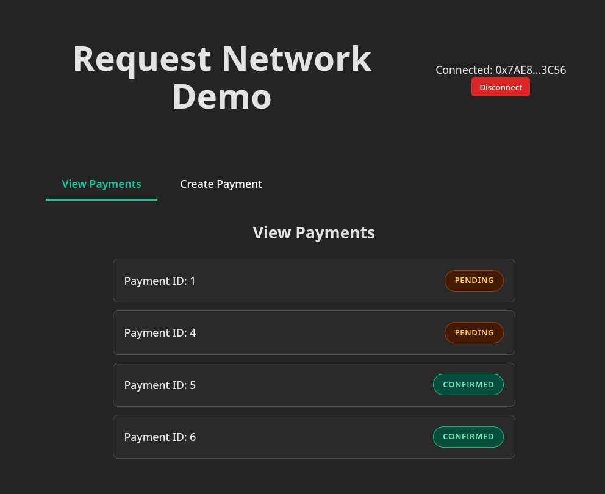

# Pay from Safe Multisig

The Request Network Templates and Example Apps support paying a request from a Safe multisig wallet.

* When connecting your wallet, select **WalletConnect.**
* Copy the **WalletConnect Pairing Code.**

<figure><figcaption></figcaption></figure>

* Click the **WalletConnect** button on the Safe top-navigation bar and paste the **Pairing Code** into the resulting dialog.

<figure><figcaption></figcaption></figure>

<figure><figcaption></figcaption></figure>
