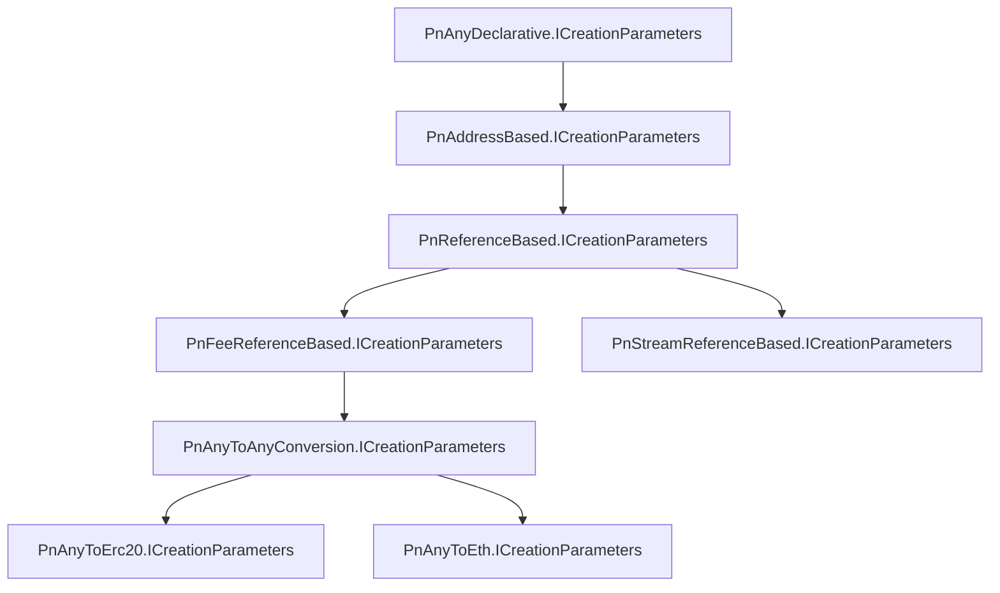

# createRequest()

## Description

Create an unencrypted request

## Parameters

<table data-full-width="true"><thead><tr><th>Name</th><th>Type</th><th data-type="checkbox">Required?</th><th>Description</th></tr></thead><tbody><tr><td>parameters</td><td><a href="createrequest.md#icreaterequestparameters">ICreateRequestParameters</a></td><td>true</td><td>Parameters to create a request</td></tr><tr><td>options</td><td><a href="createrequest.md#icreaterequestoptions">ICreateRequestOptions</a></td><td>false</td><td>Options to create a request</td></tr></tbody></table>

## Returns

Promise<[Request](../request/)>

## Types and Interfaces

### ICreateRequestParameters

<table data-full-width="true"><thead><tr><th>Name</th><th>Type</th><th data-type="checkbox">Required?</th><th>Description</th></tr></thead><tbody><tr><td>requestInfo</td><td><a href="createrequest.md#irequestinfo">IRequestInfo</a></td><td>true</td><td>Core request contents</td></tr><tr><td>signer</td><td><a href="createrequest.md#iidentity">IIdentity</a></td><td>true</td><td>Identity of the creator and signer of the request. Must be either the payee or payer.</td></tr><tr><td>paymentNetwork</td><td><a href="createrequest.md#paymentnetworkcreateparameters">PaymentNetworkCreateParameters</a></td><td>false</td><td>Payment method</td></tr><tr><td>topics</td><td>string[]</td><td>false</td><td>List of hashes, usually one for each of the request stakeholders</td></tr><tr><td>contentData</td><td>Object</td><td>false</td><td>Additional arbitrary request contents</td></tr><tr><td>disablePaymentDetection</td><td>boolean</td><td>false</td><td>Disable payment detection</td></tr><tr><td>disableEvents</td><td>boolean</td><td>false</td><td>Diable event callbacks</td></tr></tbody></table>

### ICreateRequestOptions

<table data-full-width="true"><thead><tr><th>Name</th><th>Type</th><th data-type="checkbox">Requried</th><th>Description</th></tr></thead><tbody><tr><td>skipRefresh</td><td>boolean</td><td>false</td><td>Disable the request refresh after creation. Warning: the <code>balance</code> will be null.</td></tr></tbody></table>

### IRequestInfo

<table data-full-width="true"><thead><tr><th>Name</th><th>Type</th><th data-type="checkbox">Required?</th><th>Description</th></tr></thead><tbody><tr><td>currency</td><td>string | <a href="createrequest.md#icurrency">ICurrency</a></td><td>true</td><td>The currency in which the request is denominated. Not necessarily the currency in which the payment will occur.</td></tr><tr><td>expectedAmount</td><td>number | string</td><td>true</td><td>The requested amount in machine-readable integer units.</td></tr><tr><td>payee</td><td><a href="createrequest.md#iidentity">IIdentity</a></td><td>false</td><td>Identity of the payee. Required if payer not set</td></tr><tr><td>payer</td><td><a href="createrequest.md#iidentity">IIdentity</a></td><td>false</td><td>Identity of the payer. Required if payee not set</td></tr><tr><td>extensionsData</td><td>any[]</td><td>false</td><td>Raw extensionsData. Not recommended. Prefer <code>contentData</code> and <code>paymentNetwork</code> instead.</td></tr><tr><td>timestamp</td><td>number (Unix timestamp)</td><td>false</td><td>Timestamp when request is created. User provided, so this is an agreement between payee and payer.</td></tr><tr><td>nonce</td><td>number</td><td>false</td><td>Optional nonce to differentiate identical requests created at the same timestamp.</td></tr></tbody></table>

### IIdentity

<table data-full-width="true"><thead><tr><th>Name</th><th>Type</th><th data-type="checkbox">Required</th><th>Description</th></tr></thead><tbody><tr><td>type</td><td><a href="createrequest.md#types.identity.type">Types.Identity.TYPE</a></td><td>true</td><td>Identity type</td></tr><tr><td>value</td><td>string</td><td>true</td><td>Identity address</td></tr></tbody></table>

### Types.Identity.TYPE

<table data-full-width="true"><thead><tr><th>Name</th><th>Value</th><th>Description</th></tr></thead><tbody><tr><td>ETHEREUM_ADDRESS</td><td>'ethereumAddress'</td><td>Externally owned account (EOA)</td></tr><tr><td>ETHEREUM_SMART_CONTRACT</td><td>'ethereumSmartContract'</td><td>Smart Contract. Not supported.</td></tr></tbody></table>

### PaymentNetworkCreateParameters

<table data-full-width="true"><thead><tr><th>Name</th><th>Type</th><th data-type="checkbox">Required</th><th>Description</th></tr></thead><tbody><tr><td>id</td><td><a href="createrequest.md#types.extension.payment_network_id">Types.Extension.PAYMENT_NETWORK_ID</a></td><td>true</td><td>Payment network ID</td></tr><tr><td>parameters</td><td><a href="createrequest.md#icreationparameters">ICreationParameters</a></td><td>true</td><td>Payment network parameters. Contents depend on <code>id</code></td></tr></tbody></table>

### ICurrency

<table data-full-width="true"><thead><tr><th>Name</th><th>Type</th><th data-type="checkbox">Required?</th><th>Description</th></tr></thead><tbody><tr><td>type</td><td><a href="createrequest.md#types.requestlogic.currency">Types.RequestLogic.CURRENCY</a></td><td>true</td><td>Currency type</td></tr><tr><td>value</td><td>string</td><td>true</td><td>
Depends on type.
<ul><li>ERC20 contract address '0x123'</li><li>Fiat symbol 'USD'</li><li>Native symbol 'ETH'</li></ul></td></tr><tr><td>network</td><td>ChainName</td><td>false</td><td>The chain on which the currency exists</td></tr></tbody></table>

### Types.RequestLogic.CURRENCY

<table data-full-width="true"><thead><tr><th>Name</th><th>Value</th><th></th></tr></thead><tbody><tr><td>ETH</td><td>'ETH'</td><td>Native (ETH, XDAI, etc.)</td></tr><tr><td>BTC</td><td>'BTC'</td><td>Bitcoin</td></tr><tr><td>ISO4217</td><td>'ISO4217'</td><td>Fiat (USD, EUR, etc.)</td></tr><tr><td>ERC20</td><td>'ERC20'</td><td>Non-native fungible currency (USDC, REQ, etc.)</td></tr><tr><td>ERC777</td><td>'ERC777'</td><td>Streamable fungible currency (USDCx, REQx, etc.)</td></tr></tbody></table>

### Types.Extension.PAYMENT\_NETWORK\_ID

<table data-full-width="true"><thead><tr><th>Name</th><th>Value</th><th>Description</th></tr></thead><tbody><tr><td>ANY_DECLARATIVE</td><td>'pn-any-declarative'</td><td>Payer declares payment sent. Payee declares payment received.</td></tr><tr><td>ANY_TO_ERC20_PROXY</td><td>'pn-any-to-erc20-proxy'</td><td>Swap to ERC20 before sending to payee</td></tr><tr><td>ANY_TO_ETH_PROXY</td><td>'pn-any-to-eth-proxy'</td><td>Swap to native token before sending to payee. Only works on EVM-compatible chains.</td></tr><tr><td>ANY_TO_NATIVE_TOKEN</td><td>'pn-any-to-native-token'</td><td>Swap to native token before sending to payee. Only works on NEAR.</td></tr><tr><td>BITCOIN_ADDRESS_BASED</td><td>'pn-bitcoin-address-based'</td><td>Payee generates a new Bitcoin address. Use block explorer to detect all payments to that address.</td></tr><tr><td>ERC20_ADDRESS_BASED</td><td>'pn-erc20-address-based'</td><td>Payee generates a new Ethereum address. Use block explorer to detect all payments to that address.</td></tr><tr><td>ERC20_FEE_PROXY_CONTRACT</td><td>'pn-erc20-fee-proxy-contract'</td><td>Send ERC20 via smart contract with an optional fee.</td></tr><tr><td>ERC20_PROXY_CONTRACT</td><td>'pn-erc20-proxy-contract'</td><td>Send ERC20 via smart contract</td></tr><tr><td>ERC20_TRANSFERABLE_RECEIVABLE</td><td>'pn-erc20-transferable-receivable'</td><td>Mint a Request as an NFT. The holder receives the payment.</td></tr><tr><td>ERC777_STREAM</td><td>'pn-erc777-stream'</td><td>Superfluid stream</td></tr><tr><td>ETH_FEE_PROXY_CONTRACT</td><td>'pn-eth-fee-proxy-contract'</td><td>Send native token via smart contract with an optional fee.</td></tr><tr><td>ETH_INPUT_DATA</td><td>'pn-eth-input-data'</td><td>Send native token with paymentReference in the call data.</td></tr><tr><td>NATIVE_TOKEN</td><td>'pn-native-token'</td><td>Send native token via smart contract with an optional fee on NEAR.</td></tr><tr><td>TESTNET_BITCOIN_ADDRESS_BASED</td><td>'pn-testnet-bitcoin-address-based'</td><td>Payee generates a new Bitcoin testnet address. Use block explorer to detect all payments to that address.</td></tr></tbody></table>


Escrow payments use the ERC20\_FEE\_PROXY\_CONTRACT payment network.


## ICreationParameters

### PnAnyDeclarative.ICreationParameters

<table data-full-width="true"><thead><tr><th>Name</th><th>Type</th><th data-type="checkbox">Required</th><th>Description</th></tr></thead><tbody><tr><td>paymentInfo</td><td>any</td><td>false</td><td></td></tr><tr><td>refundInfo</td><td>any</td><td>false</td><td></td></tr><tr><td>payeeDelegate</td><td><a href="createrequest.md#iidentity">IIdentity</a></td><td>false</td><td>Identity that can update the request on behalf of the payee</td></tr><tr><td>payerDelegate</td><td><a href="createrequest.md#iidentity">IIdentity</a></td><td>false</td><td>Identity that can update the request on behalf of the payer</td></tr><tr><td>salt</td><td>string</td><td>false</td><td>A random number with at least 8 bytes of randomness. It must be unique to each request</td></tr></tbody></table>

### PnAddressBased.ICreationParameters

<table data-full-width="true"><thead><tr><th>Name</th><th>Type</th><th data-type="checkbox">Required</th><th>Description</th></tr></thead><tbody><tr><td>paymentAddress</td><td>string</td><td>false</td><td>The payment recipient address</td></tr><tr><td>refundAddress</td><td>string</td><td>false</td><td>The refund recipient address</td></tr></tbody></table>

### PnReferenceBased.ICreationParameters

<table data-full-width="true"><thead><tr><th>Name</th><th>Type</th><th data-type="checkbox">Required</th><th>Description</th></tr></thead><tbody><tr><td>salt</td><td>string</td><td>false</td><td></td></tr><tr><td>paymentNetworkName</td><td>ChainName</td><td>false</td><td>The chain name on which the payment will occur</td></tr></tbody></table>

### PnFeeReferenceBased.ICreationParameters

<table data-full-width="true"><thead><tr><th>Name</th><th>Type</th><th data-type="checkbox">Required</th><th>Description</th></tr></thead><tbody><tr><td>feeAddress</td><td>string</td><td>false</td><td>The address to which fees will be sent</td></tr><tr><td>feeAmount</td><td>string</td><td>false</td><td>The fee amount in machine-readable integer units</td></tr></tbody></table>

### PnAnyToAnyConversion.ICreationParameters

<table data-full-width="true"><thead><tr><th>Name</th><th>Type</th><th data-type="checkbox">Required</th><th>Description</th></tr></thead><tbody><tr><td>maxRateTimespan</td><td>number</td><td>false</td><td>The maximum acceptable time span between the payment and the conversion rate timestamp </td></tr><tr><td>network</td><td>ChainName</td><td>false</td><td>The network of the tokens accepted for payments</td></tr></tbody></table>

### PnAnyToErc20.ICreationParameters

<table data-full-width="true"><thead><tr><th>Name</th><th>Type</th><th data-type="checkbox">Required</th><th>Description</th></tr></thead><tbody><tr><td>acceptedTokens</td><td>string[]</td><td>false</td><td>A list of token addresses accepted for payments and refunds</td></tr><tr><td>network</td><td>EvmChainName</td><td>false</td><td>the network of the tokens accepted for payments</td></tr></tbody></table>

### PnAnyToEth.ICreationParameters

Identical to [PnAnyToAnyConversion.ICreationParameters](createrequest.md#pnanytoanyconversion.icreationparameters)

### PnStreamReferenceBased.ICreationParameters

Equal to [IOriginalRequestCreationParameters](createrequest.md#ioriginalrequestcreationparameters) OR [ISubsequentRequestCreationParameters](createrequest.md#isubsequentrequestcreationparameters)

### IOriginalRequestCreationParameters

<table data-full-width="true"><thead><tr><th>Name</th><th>Type</th><th data-type="checkbox">Required</th><th>Description</th></tr></thead><tbody><tr><td>expectedFlowRate</td><td>string</td><td>true</td><td></td></tr><tr><td>expectedStartDate</td><td>string</td><td>true</td><td></td></tr></tbody></table>

### ISubsequentRequestCreationParameters

<table data-full-width="true"><thead><tr><th>Name</th><th>Type</th><th data-type="checkbox">Required</th><th>Description</th></tr></thead><tbody><tr><td>previousRequestId</td><td>string</td><td>true</td><td></td></tr><tr><td>originalRequestId</td><td>string</td><td>true</td><td></td></tr><tr><td>recurrenceNumber</td><td>string</td><td>true</td><td></td></tr></tbody></table>

