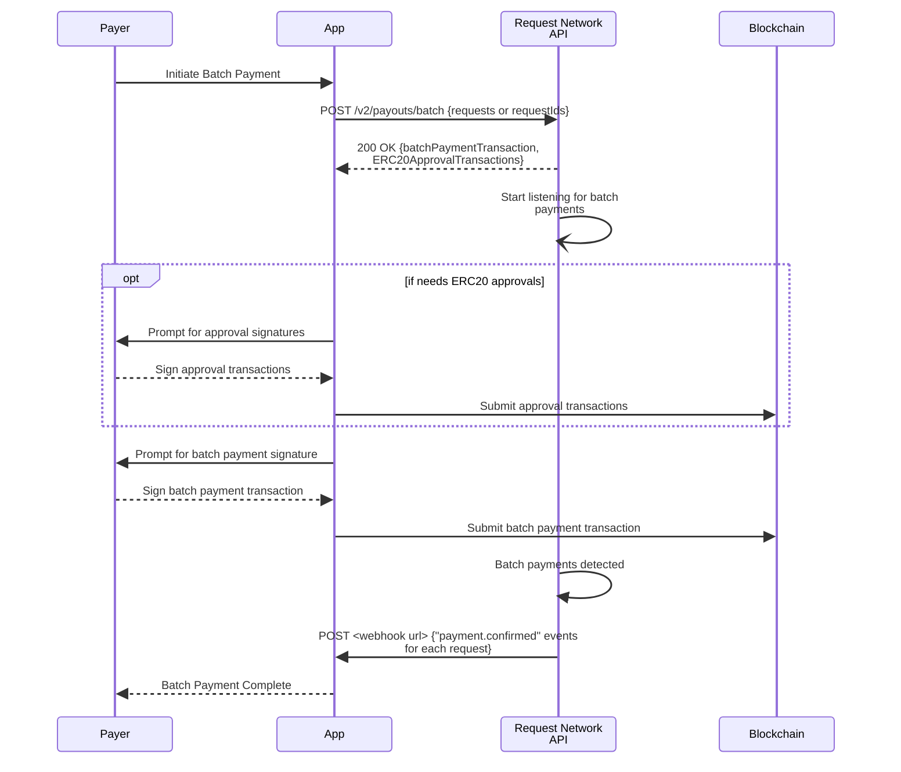

# Batch Payments


**Talk to an expert**

Discover how Request Network API can enhance your app's features - [book a call](https://calendly.com/mariana-rn/request-network-demo-docs) with us.


## Overview

Batch payments enable you to process multiple payment requests efficiently in a single blockchain transaction, reducing gas costs and simplifying multi-recipient workflows.

**Two Types of Batch Payments:**

### **Batch Pay Invoices**

Process previously created requests using their request IDs and receive payment calldata that can be executed on-chain to pay multiple requests simultaneously.

### **Batch Payouts**

Submit new payment requests that are immediately processed, creating requests and returning payment calldata in a single API call for instant multi-recipient payments.

## Key Benefits

* **Gas Efficiency**: Significantly reduce transaction costs by batching multiple payments
* **Simplified UX**: Process up to 200 payments in a single transaction
* **Mixed Payment Types**: Support ERC20, native tokens, and conversion payments in the same batch
* **Atomic Execution**: All payments succeed or fail together, ensuring consistency


**Single Network Limitation**: All requests in a batch must be on the same blockchain network. Need multi-network batch payments? [Book a call](https://calendly.com/mariana-rn/request-network-demo-docs) to discuss this feature.


## Batch Processing Limits

The theoretical limit for batch payments is **100-200 payments per transaction**, depending on:

* Payment complexity (ERC20 vs native tokens vs conversions)
* Available block gas limit on the target network
* Smart contract computational requirements

For optimal performance, we recommend starting with smaller batches (10-50 payments) and scaling based on your network conditions.

## Batch Payment Workflow



## Endpoints


[Broken link](broken-reference)


## Implementation Examples

The following examples demonstrate how to implement batch payment calldata execution in your application. **Note**: The API returns unsigned transaction calldata - your application must handle sending these transactions to the blockchain.

#### Batch Pay Invoices Example

```typescript
import { ethers } from 'ethers';

// Get unsigned calldata to pay existing requests by their IDs
const batchPayResponse = await fetch('https://api.request.network/v2/payouts/batch', {
  method: 'POST',
  headers: {
    'Content-Type': 'application/json',
    'x-api-key': 'your-api-key',
    'x-platform-id': 'your-platform-id'
  },
  body: JSON.stringify({
    requestIds: [
      "01e273ecc29d4b526df3a0f1f05ffc59372af8752c2b678096e49ac270416a7cdb",
      "02f384fdd39e5c627e04b1f2e6fd60593783b8863c3c789197f5bd381527b8ecd"
    ],
    payer: "0x2e2E5C79F571ef1658d4C2d3684a1FE97DD30570"
  })
});

const { batchPaymentTransaction, ERC20ApprovalTransactions } = await batchPayResponse.json();

// Your app must implement sending these transactions to the blockchain
const provider = new ethers.providers.Web3Provider(window.ethereum);
const signer = provider.getSigner();

// 1. Handle ERC20 approvals if needed
for (const approval of ERC20ApprovalTransactions) {
  const tx = await signer.sendTransaction(approval);
  await tx.wait();
}

// 2. Send the batch payment transaction
const batchTx = await signer.sendTransaction(batchPaymentTransaction);
await batchTx.wait();
```

#### Batch Payouts Example

```typescript
// Create new requests and process them immediately
const batchPayResponse = await fetch('https://api.request.network/v2/payouts/batch', {
  method: 'POST',
  headers: {
    'Content-Type': 'application/json',
    'x-api-key': 'your-api-key',
    'x-platform-id': 'your-platform-id'
  },
  body: JSON.stringify({
    requests: [
      {
        payee: "0x6923831ACf5c327260D7ac7C9DfF5b1c3cB3C7D7",
        amount: "10",
        invoiceCurrency: "USD",
        paymentCurrency: "USDC-sepolia"
      },
      {
        payee: "0xb07D2398d2004378cad234DA0EF14f1c94A530e4",
        amount: "25.50",
        invoiceCurrency: "EUR", 
        paymentCurrency: "DAI-sepolia"
      }
    ],
    payer: "0x2e2E5C79F571ef1658d4C2d3684a1FE97DD30570"
  })
});

const { batchPaymentTransaction, ERC20ApprovalTransactions } = await batchPayResponse.json();

// Your app must implement the blockchain transaction execution
// (same pattern as Batch Pay Invoices example above)
```

## Supported Payment Types

Batch payments support mixing different payment types in a single transaction:

* **ERC20 Token Payments**: Standard token transfers
* **Native Token Payments**: ETH, MATIC, etc.
* [**Conversion Payments**](https://docs.request.network/glossary#conversion-payment): Requests denominated in one currency but paid in another (e.g., USD invoices paid with USDC)

## Key Implementation Notes

### Your Responsibility

* **API Call**: Your application calls the Request Network API to get transaction data
* **Blockchain Execution**: Your application executes the returned transaction data on the blockchain
* **Error Handling**: Your application handles transaction failures and retries

### Best Practices

1. **Validate Addresses**: Always validate recipient addresses before submitting batch payments
2. **Test on Testnets**: Start with small batches on test networks before production deployment
3. **Handle Failures Gracefully**: Implement proper error handling for transaction failures
4. **Gas Estimation**: Consider gas costs when determining optimal batch sizes
5. **User Experience**: Provide clear progress indicators for multi-step approval processes

### Error Handling

Common error scenarios and their solutions:

* **Network Mismatch**: Ensure all requests use the same blockchain network
* **Insufficient Funds**: Verify payer has sufficient balance for all payments plus gas
* **Invalid Addresses**: Validate all payee addresses before batch submission
* **Gas Limit Exceeded**: Reduce batch size if hitting network gas limits

## Demo Application

See the batch payment feature in action in our EasyInvoice demo application:

### EasyInvoice Batch Pay Invoices



### EasyInvoice: Batch Payouts



For detailed information on all available endpoints and their parameters, please refer to the full [Request Network API Reference](https://api.request.network/open-api).

For more implementation details, explore the [EasyInvoice source code](https://github.com/RequestNetwork/easy-invoice).
