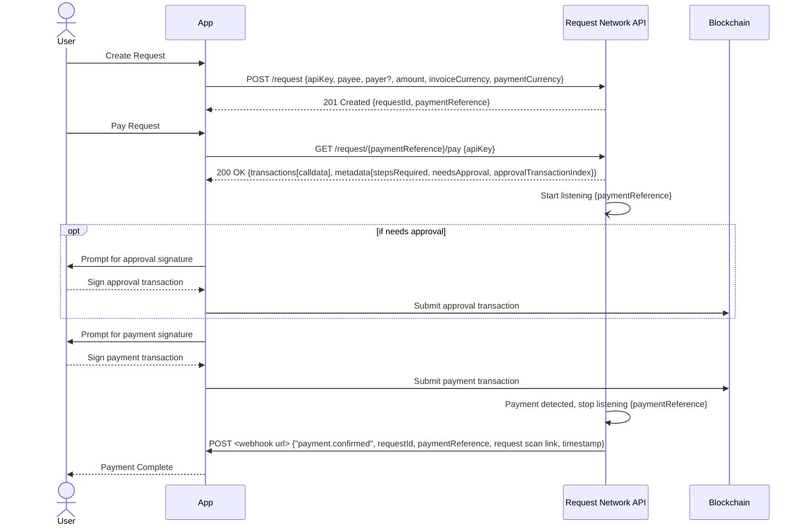

# Create and Pay Requests

The Request Network API provides an interface for managing payment requests within your application. It simplifies creating, tracking, and paying requests. This includes generating requests with specific details, securely facilitating payments through blockchain transactions, and providing real-time notifications via webhooks to keep your application synchronized with payment statuses.

**Core Functionality:**

At its core, the Request Network API empowers you to:

* **Create Requests:** Define payment requests with essential information such as payee, payer (optional), amount, and currency details.
* **Facilitate Payments:** Guide users through the payment process, leveraging blockchain transactions for secure and transparent value transfer.
* **Deliver Webhook Notifications:** Receive instant updates on payment status changes, enabling your application to react dynamically to completed transactions.

**Workflow Overview:**

The following diagram illustrates the typical flow for creating and paying requests using the Request Network API:


[https://api.request.network/open-api/openapi.json](https://api.request.network/open-api/openapi.json)



The `invoiceCurrency`and `paymentCurrency` strings must each be the `id` of a token listed in the [request-network-token-list.md](../general/request-network-token-list.md "mention")



[https://api.request.network/open-api/openapi.json](https://api.request.network/open-api/openapi.json)



[https://api.request.network/open-api/openapi.json](https://api.request.network/open-api/openapi.json)


For detailed information on all available endpoints and their parameters, please refer to the full [Request Network API Reference](https://api.request.network/open-api)
