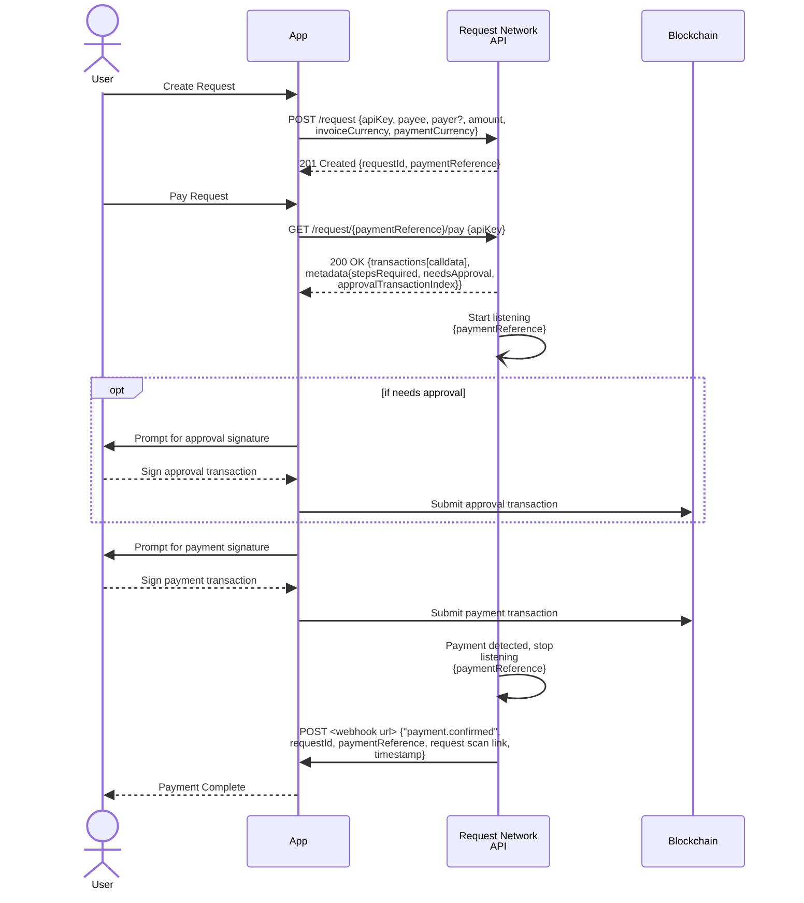

# Create and Pay Requests


**Talk to an expert**

Discover how Request Network API can enhance your app's features - [book a call](https://calendly.com/mariana-rn/request-network-demo-docs) with us.


## **Core Functionality**

At its core, the Request Network API empowers you to:

* **Create Requests:** Define payment requests with information such as payee, payer (optional), amount, currency, and recurrence (optional).
* **Facilitate Payments:** Return transaction calldata, ready to be signed by end-users and sent to the blockchain for secure and transparent value transfer.
* **Deliver Webhook Notifications:** Receive instant updates on payment status changes, enabling your application to react dynamically to completed transactions.
* **Fee Collection:** When paying a request, you can specify a fee percentage (between 0 and 100) and a fee address, which will add the fee on top of the payment amount - meaning the payer will pay the original amount plus the fee percentage, with the fee portion being sent to the specified fee address.


[Broken link](broken-reference)



[Broken link](broken-reference)



[Broken link](broken-reference)



[Broken link](broken-reference)



[Broken link](broken-reference)


For detailed information on all available endpoints and their parameters, please refer to the full [Request Network API Reference](https://api.request.network/open-api)

## Create and Pay Request Workflow

The following diagram illustrates the typical flow for creating and paying requests using the Request Network API:

