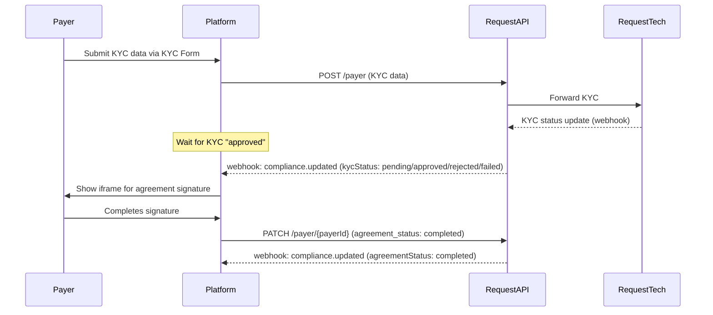
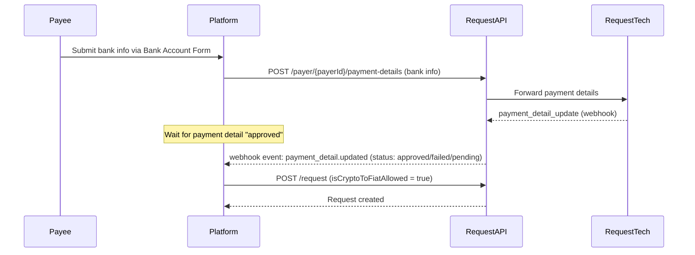
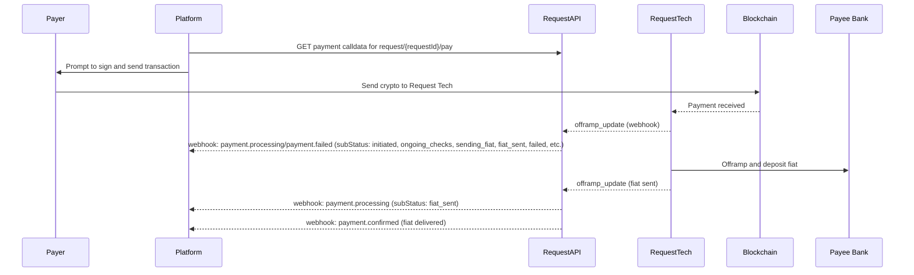

# Crypto-to-fiat Payments


Crypto-to-fiat payments are only available in V2.


Crypto-to-fiat payments let a payer pay a Request in cryptocurrency, while the payee receives fiat directly in their bank account. This is achieved by combining compliance (KYC/Agreement) and bank account registration (payment detail) flows, and combining the Request Network crypto payment with [Request Tech](https://www.request.finance/tech) offramp infrastructure.

[EasyInvoice](easyinvoice-api-demo-app.md) includes a reference implementation for this flow.

### Understanding `clientUserId`

Many `/payer` endpoints in the Request Network API require a `clientUserId` as a path parameter. This value is an **arbitrary identifier** chosen by your platform to represent a user (the payer) in your own system.

* **You control the format:** The `clientUserId` can be any unique string that makes sense for your application. It can be a UUID, email address, database ID, or anything unique per user on your platform.
* **EasyInvoice Example:** In the EasyInvoice demo app, `clientUserId` is set to the user's email address.
* **Why is this useful?** This approach allows you to integrate the Request Network API without having to change your existing user management logic. You simply pass your own identifier to the API, and all payer-related compliance, agreement, and payment detail records will be associated with that value.

**Example usage:**

```
GET /v2/payer/{clientUserId}
PATCH /v2/payer/{clientUserId}
POST /v2/payer/{clientUserId}/payment-details
GET  /v2/payer/{clientUserId}/payment-details
```

In each case, replace `{clientUserId}` with your chosen identifier for the user.

## 1. Compliance & Payer Onboarding

Before a payer can use crypto-to-fiat, they must complete compliance steps:

* **KYC**: The payer must submit a KYC application.
* **Agreement**: The payer must sign a compliance agreement (via an iframe flow).
* **Bank Account**: The payee's bank account must be associated with a payer for compliance reasons, even though the payee owns the account.

### **Compliance Flow Diagram**



### **Flow Explanation**

1. **Submit KYC**: The platform collects KYC information from the payer and submits it to the API.
2. **KYC Review**: The platform receives webhook updates as the KYC is processed (`compliance.updated` with `kycStatus`).
3. **Agreement Signature**: The platform displays an iframe for the payer to sign the compliance agreement. Once signed, the platform calls the API to update the agreement status.
4. **Agreement Confirmation**: The platform receives a webhook update when the agreement is completed (`compliance.updated` with `agreementStatus`).

### Relevant Endpoints

* `POST /payer`: Submit KYC application.
* `GET /payer/{clientUserId}`: Get compliance status for a payer.&#x20;
* `PATCH /payer/{clientUserId}`: Update agreement status after signature.


[Broken link](broken-reference)



[Broken link](broken-reference)



[Broken link](broken-reference)


### 2. Setting Up a Crypto-to-Fiat Request (Payee Flow)

Before a payer can pay in crypto and the payee can receive fiat, the platform must:

* **Submit the payee’s bank account details** (associated with a payer for compliance).
* **Wait for approval** of those payment details (usually less than 60 seconds, confirmed via webhook).
* **Create a new request** with `isCryptoToFiatAllowed = true`.

### **Payment Details Flow Diagram**



### **Flow Explanation**

1. **Submit Bank Account**: The platform submits the payee’s bank account details, associating them with a payer. The Request Network API forwards these details to the offramp provider (Request Tech).
2. **Approval**: The platform receives a webhook (`payment_detail.updated`) indicating if the payment details are approved, failed, or pending.
3. **Create Request**: Once approved, the platform creates a new request as usual, but with the `isCryptoToFiatAllowed` flag set to `true`. This signals that the request is eligible for crypto-to-fiat payment.


In EasyInvoice, the Payee Bank Account Registration is integrated directly into the Create Invoice Form. If the user clicks Create before the Payee Bank Account has been approved, a loading indicator appears until approval is granted.


### Relevant Endpoints

* `POST /payer/{clientUserId}/payment-details`: Create payment details (register bank account) for a payee.
* `GET /payer/{clientUserId}/payment-details`: Get payment details (bank accounts) for a payee.&#x20;
* `POST /v2/request` with `isCryptoToFiatAllowed = true`: Create a new crypto-to-fiat request&#x20;


[Broken link](broken-reference)



[Broken link](broken-reference)



[Broken link](broken-reference)


## 3. Paying a Crypto-to-Fiat Request

The payer pays in crypto; Request Tech handles offramping and fiat payout.

### **Payment Flow Diagram**



**Flow Explanation**

1. **Get Payment Calldata**: The platform fetches payment calldata for the request.
2. **User Pays**: The payer signs and submits the transaction, sending crypto to Request Tech.
3. **Offramp Processing**: Request Tech receives the crypto and begins the offramp process.
4. **Status Updates**: The platform receives webhook events as the offramp progresses ([payment.processing](https://vscode-file/vscode-app/Applications/Visual%20Studio%20Code.app/Contents/Resources/app/out/vs/code/electron-sandbox/workbench/workbench.html), [payment.failed](https://vscode-file/vscode-app/Applications/Visual%20Studio%20Code.app/Contents/Resources/app/out/vs/code/electron-sandbox/workbench/workbench.html)), with [subStatus](https://vscode-file/vscode-app/Applications/Visual%20Studio%20Code.app/Contents/Resources/app/out/vs/code/electron-sandbox/workbench/workbench.html) indicating the current offramp stage.
5. **Fiat Delivered**: When the offramp is complete, the platform receives a final webhook ([payment.processing](https://vscode-file/vscode-app/Applications/Visual%20Studio%20Code.app/Contents/Resources/app/out/vs/code/electron-sandbox/workbench/workbench.html) with [subStatus: fiat\_sent](https://vscode-file/vscode-app/Applications/Visual%20Studio%20Code.app/Contents/Resources/app/out/vs/code/electron-sandbox/workbench/workbench.html)), and then a [payment.confirmed](https://vscode-file/vscode-app/Applications/Visual%20Studio%20Code.app/Contents/Resources/app/out/vs/code/electron-sandbox/workbench/workbench.html) event.

## Crypto-to-fiat Webhook Event Reference

|                          |                                        |                                                                                                                                                                                                                                                                                                         |
| ------------------------ | -------------------------------------- | ------------------------------------------------------------------------------------------------------------------------------------------------------------------------------------------------------------------------------------------------------------------------------------------------------- |
| Event                    | Description                            | subStatus values (if any)                                                                                                                                                                                                                                                                               |
| `compliance.updated`     | KYC/Agreement status updates           | <p><code>kycStatus</code>: <code>initiated</code>, <code>pending</code>, <code>approved</code>, <code>rejected</code>, <code>failed</code> <br><br><code>agreementStatus</code>: <code>not_started</code>, <code>pending</code>, <code>completed</code>, <code>rejected</code>, <code>failed</code></p> |
| `payment_detail.updated` | Payment detail (bank account) status   | `approved`, `failed`, `pending`                                                                                                                                                                                                                                                                         |
| `payment.processing`     | Offramp in progress                    | `initiated`, `pending_internal_assessment`, `ongoing_checks`, `sending_fiat`, `fiat_sent`, `bounced`, `retry_required`                                                                                                                                                                                  |
| `payment.failed`         | Offramp or payment failed              | `failed`, `bounced`                                                                                                                                                                                                                                                                                     |
| `payment.confirmed`      | Payment fully settled (fiat delivered) |                                                                                                                                                                                                                                                                                                         |

\


