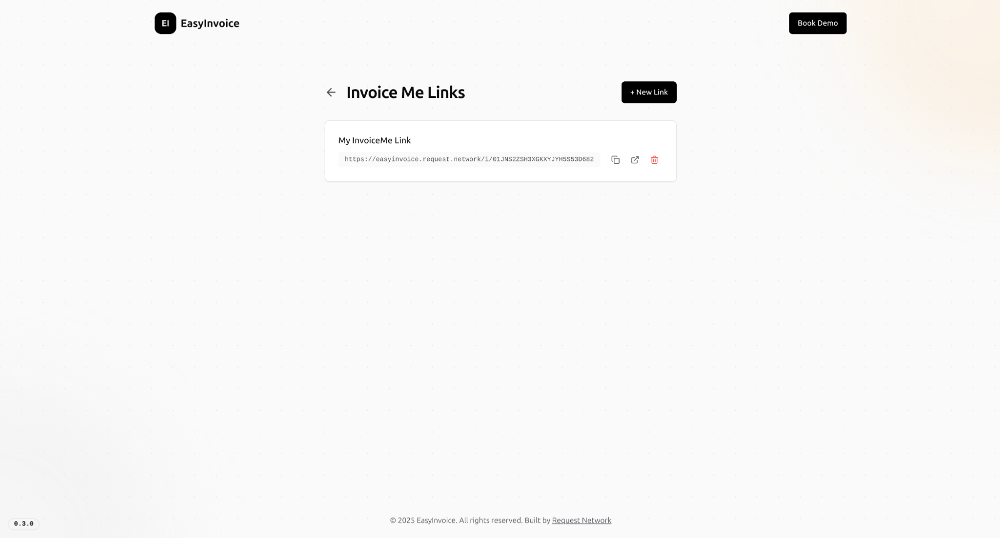
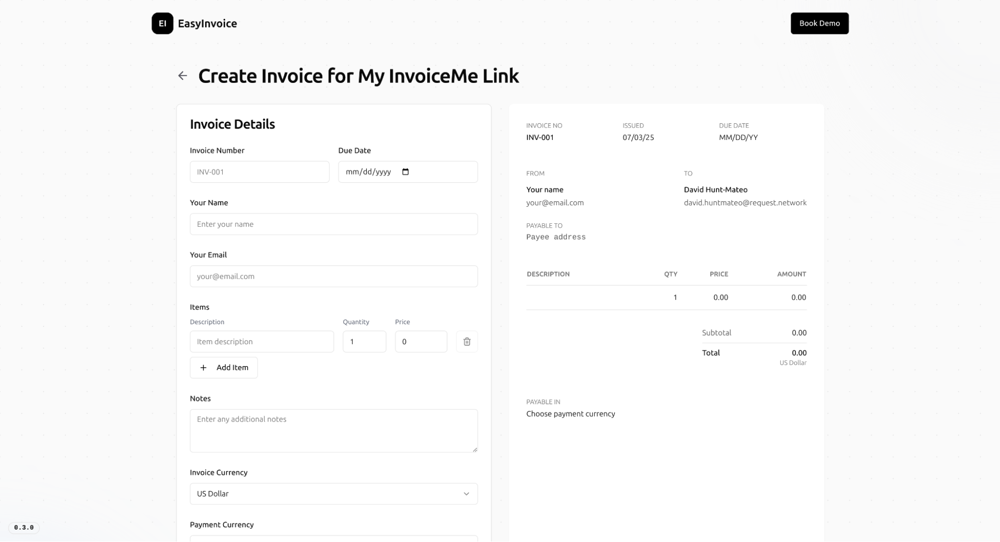

# EasyInvoice: API Demo App

EasyInvoice is a web application built with Next.js that allows users to create and manage invoices, and accept crypto payments via the Request Network API. It mimics Web2 apps in its functionalities, providing a user-friendly experience with Google login and real-time updates.


**Talk to an expert**

Discover how your app can have its own EasyInvoice features - [book a call](https://calendly.com/mariana-rn/request-network-demo-docs) with us.


## Key Features

### Login

* **Google Login**: Securely log in to your account using Google OAuth.

<figure><figcaption>
EasyInvioce Login Page
</figcaption></figure>

### **Invoice Creation**

* **Invoice Creation**: A simple form to create invoices.
  * Client name and email fields.
  * Items, amounts, and notes fields.
  * Invoice currency and payment currency options, supporting currency conversion via the Request Network API.
* **Currency Conversion**: uses on-chain price feeds to calculate the exact payment currency amount based on the invoice currency at the moment of payment so you always receive the correct amount.

<figure><figcaption>
EasyInvoice Create Invoice Page
</figcaption></figure>

### **Dashboard**

* **Dashboard**: View key metrics and a table of your invoices.

<figure><figcaption>
EasyInvoice Dashboard
</figcaption></figure>

### Invoice Payment

* **Invoice Payment:**
  * View invoice details and initiate payment using transaction calldata provided by the Request Network API.
  * Compatible with 50+ different crypto wallets.
* **Real-time Updates**: The app receives webhooks from the Request Network API to update the invoice status in real-time.

<figure><figcaption>
EasyInvoice Invoice Payment Page
</figcaption></figure>

<figure><figcaption>
EasyInvoice supports 50+ wallets via Reown AppKit
</figcaption></figure>

### Recurring Invoices

* **Recurring Invoice**: Automatically create new invoices based on the selected start date and frequency

<figure><figcaption>
Create New Invoice page - Recurring Invoice Enabled
</figcaption></figure>

<figure><figcaption>
Invoice Dashboard - Recurring Invoice
</figcaption></figure>

### Invoice Crosschain Payment


**Warning:** Crosschain payments are currently only available in our staging environment at [https://easyinvoice.stage.request.network](https://easyinvoice.stage.request.network) and are not ready for production use. Use with caution.


<figure><figcaption></figcaption></figure>

### Direct Payment

* **Direct Payment**: Send a payment without having to create a request first.

<figure><figcaption>
EasyInvoice Direct Payment page
</figcaption></figure>

### InvoiceMe Link

* **InvoiceMe Link**: Prompt clients to send you an invoice prefilled with your name and email address.

<figure><figcaption>
Create InvoiceMe Link page
</figcaption></figure>

<figure><figcaption>
Create Invoice via InvoiceMe Link
</figcaption></figure>

<table data-card-size="large" data-view="cards" data-full-width="false"><thead><tr><th></th><th></th><th></th><th data-hidden data-card-target data-type="content-ref"></th></tr></thead><tbody><tr><td></td><td>🕹️ <strong>Try it out</strong></td><td></td><td><a href="https://easyinvoice.request.network">https://easyinvoice.request.network</a></td></tr><tr><td></td><td>ℹ️ <strong>View Source</strong></td><td></td><td><a href="https://github.com/RequestNetwork/easy-invoice">https://github.com/RequestNetwork/easy-invoice</a></td></tr></tbody></table>

## Usage

1. **Login:** Log in with your Google account to access the dashboard.
2. **Create Invoice:** Fill out the invoice form with the necessary details, including client information, amount, currency, and payee address.
   1. If the invoice currency is USD, you must select a payment currency (Sepolia ETH or FAU) for conversion.
   2. For non-conversion scenarios, the payment currency will be the same as the invoice currency.
3. **Pay Invoice:** Connect your wallet and initiate the payment. The app will guide you through the steps, including ERC20 approval and transaction confirmation.
4. **Monitor Status:** Track the payment status in real-time on the invoice details page and the dashboard.
