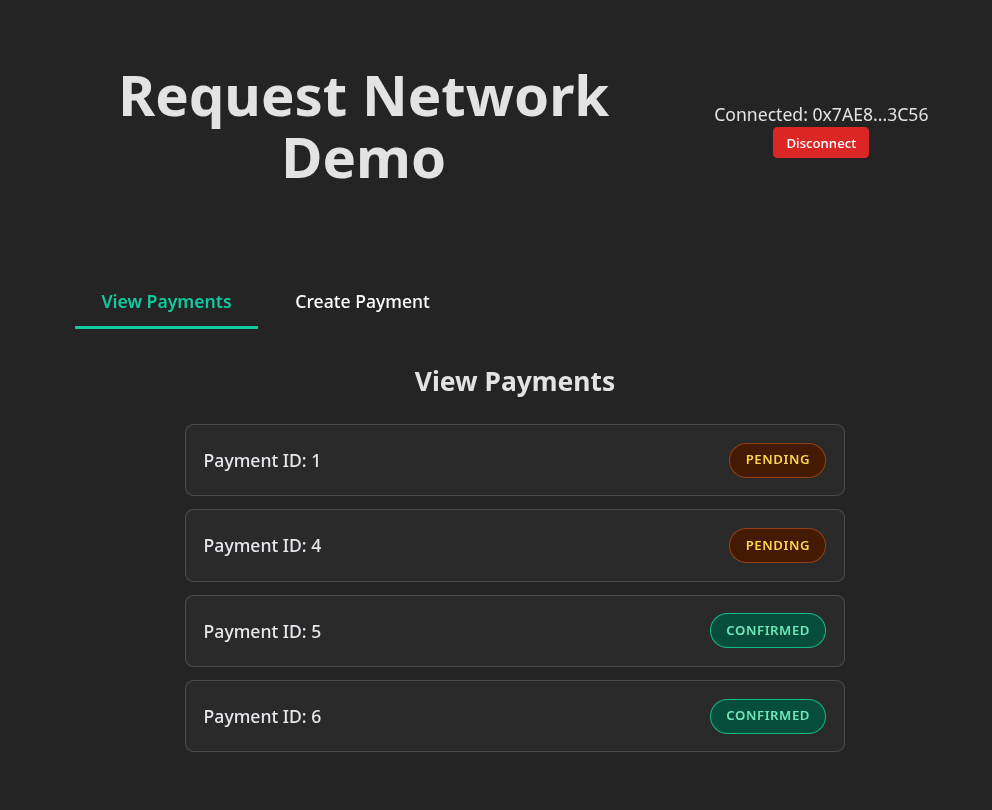

# Integration Tutorial

We will be creating a simple node server integrating the Request Network API to create payments and track their status. We are going to use `fastify` as our server and use `drizzle` with `SQLite` to store our payment data. Additionally, we'll be creating a simple React web application to interact with the API and execute payments.

View the entire codebase on [Code Sandbox](https://codesandbox.io/p/github/RequestNetwork/integration-demo/main?workspaceId=ws_ADdDA8Vov3FqF921ntkFf).

## Backend

In this section we'll create your API that integrates Request Network's API to create and track payments. After we are done with it, we'll jump over and create a web app connecting to your API and put everything together!

### Setup

As mentioned, we are using `fastify` and `drizzle` for this demo, you can of course choose whatever suits you best.

Create a new project. In it create a folder called `rn-test-backend` inside and copy over this `package.json` file to `rn-test-backend`.

```json
{
  "name": "request-api-demo",
  "version": "1.0.0",
  "description": "Request API demo",
  "main": "dist/index.js",
  "scripts": {
    "build": "tsc",
    "start": "node dist/index.js",
    "dev": "ts-node src/index.ts",
    "dev:watch": "ts-node-dev --respawn --transpile-only src/index.ts",
    "db:push": "drizzle-kit push",
    "db:generate": "drizzle-kit generate",
    "db:migrate": "drizzle-kit migrate",
    "db:studio": "drizzle-kit studio"
  },
  "keywords": [
    "fastify",
    "typescript",
    "node"
  ],
  "author": "",
  "license": "MIT",
  "devDependencies": {
    "@types/node": "^20.0.0",
    "ts-node": "^10.9.0",
    "ts-node-dev": "^2.0.0",
    "typescript": "^5.0.0"
  },
  "dependencies": {
    "@fastify/cors": "^11.1.0",
    "@types/better-sqlite3": "^7.6.13",
    "better-sqlite3": "^12.2.0",
    "dotenv": "^17.2.1",
    "drizzle-kit": "^0.31.4",
    "drizzle-orm": "^0.44.5",
    "fastify": "^5.5.0"
  }
}

```

The folder structure for the demo is going to be simple:

<div align="left"><figure><figcaption></figcaption></figure></div>

```typescript
// src/db/index.ts
import Database from 'better-sqlite3';
import { drizzle } from 'drizzle-orm/better-sqlite3';
import * as schema from './schema';

const sqlite = new Database('database.sqlite');
export const db = drizzle(sqlite, { schema });
```

```typescript
// src/db/schema.ts
import { sqliteTable, text, integer } from 'drizzle-orm/sqlite-core';

export const payments = sqliteTable('payments', {
  id: integer('id').primaryKey({ autoIncrement: true }),
  requestId: text('request_id').notNull(),
  status: text('status').notNull(),
});

export type Payment = typeof payments.$inferSelect;
```

```typescript
// src/index.ts
import 'dotenv/config';
import Fastify, { FastifyRequest, FastifyReply } from 'fastify';

const fastify = Fastify({
  logger: true
});

fastify.get('/', async (request: FastifyRequest, reply: FastifyReply) => {
  return { message: 'Hello World!' };
});

const start = async () => {
  try {
    const port =  3000;
    const host = 'localhost';
    
    await fastify.register(require('@fastify/cors'), {
      origin: true, // change to your frontend URL in production
      methods: ['GET', 'POST', 'PATCH'],
    });
    await fastify.listen({ port, host });
    console.log(`Server listening on http://${host}:${port}`);
  } catch (err) {
    fastify.log.error(err);
    process.exit(1);
  }
};

start();

```

```typescript
// drizzle-config.ts
import { defineConfig } from 'drizzle-kit';

export default defineConfig({
  schema: './src/db/schema.ts',
  out: './drizzle',
  dialect: 'sqlite',
  dbCredentials: {
    url: './database.sqlite',
  },
});
```

```json
// tsconfig.json
{
  "compilerOptions": {
    "target": "ES2020",
    "module": "commonjs",
    "lib": ["ES2020"],
    "outDir": "./dist",
    "rootDir": "./src",
    "strict": true,
    "esModuleInterop": true,
    "skipLibCheck": true,
    "forceConsistentCasingInFileNames": true,
    "resolveJsonModule": true,
    "declaration": true,
    "declarationMap": true,
    "sourceMap": true
  },
  "include": ["src/**/*"],
  "exclude": ["node_modules", "dist"]
}

```

Then run `npm install` and when that's done, run `npm run db:push`.

### Get your API key

Before starting your integration, you need to sign up on our [API portal](api-portal-manage-api-keys-and-webhooks.md), which you can access via this [link](https://portal.request.network/).

On our API portal dashboard, you can easily create an API key.

<figure><figcaption></figcaption></figure>

<figure><figcaption></figcaption></figure>

<figure><figcaption></figcaption></figure>

Now copy over its value to your `.env` file

```
// .env
RN_API_KEY=<insert-you-api-key>
RN_API_URL=https://api.request.network/v2 
```

### Create your first payment

Let's create two new endpoints, one for creating a payment on our API and the other to fetch all of the payments users have made on our API.

```typescript
// src/index.ts
import 'dotenv/config';
import Fastify, { FastifyRequest, FastifyReply } from 'fastify';
import { db } from './db';
import { payments } from './db/schema';

const fastify = Fastify({
  logger: true
});

fastify.get('/', async (request: FastifyRequest, reply: FastifyReply) => {
  return { message: 'Hello World!' };
});

interface PaymentBody {
  payee: string;
  amount: string;
  invoiceCurrency: string;
  paymentCurrency: string;
}

fastify.post('/payments', async (request: FastifyRequest<{ Body: PaymentBody }>, reply: FastifyReply) => {
  try {
    const { payee, amount, invoiceCurrency, paymentCurrency } = request.body;

    if (!payee || !amount || !invoiceCurrency || !paymentCurrency) {
      return reply.status(400).send({ 
        error: 'Missing required fields: payee, amount, invoiceCurrency, paymentCurrency' 
      });
    }

    const response = await fetch(`${process.env.RN_API_URL}/payouts`, {
      method: 'POST',
      headers: {
        'X-Api-Key': process.env.RN_API_KEY,
        'Content-Type': 'application/json'
      },
      body: JSON.stringify({
        payee,
        amount,
        invoiceCurrency,
        paymentCurrency
      })
    });

    if (!response.ok) {
      const errorText = await response.text();
      fastify.log.error(`Request Network API error: ${response.status} - ${errorText}`);
      return reply.status(response.status).send({ 
        error: 'Failed to create payment with Request Network API',
        details: errorText
      });
    }

    const rnApiResponse: any = await response.json();
    console.log('Request Network API response:', JSON.stringify(rnApiResponse, null, 2));

    const [savedPayment] = await db.insert(payments).values({
      requestId: rnApiResponse.requestId,
      status: 'pending'
    }).returning();

    console.log('Payment saved to database:', savedPayment);

    return {
      payment: savedPayment,
      calldata: {
        transactions: rnApiResponse.transactions,
        metadata: rnApiResponse.metadata
      }
    };

  } catch (error) {
    console.error('Error creating payment:', error);
    return reply.status(500).send({ 
      error: 'Internal server error',
      details: error instanceof Error ? error.message : 'Unknown error'
    });
  }
});

interface UpdatePaymentStatusBody {
  status: string;
}
// we will use this endpoint later on, don't think too much about it right now!
fastify.patch('/payments/:id', async (request: FastifyRequest<{ 
  Params: { id: string };
  Body: UpdatePaymentStatusBody 
}>, reply: FastifyReply) => {
  try {
    const { id } = request.params;
    const { status } = request.body;

    if (!status) {
      return reply.status(400).send({ 
        error: 'Status is required' 
      });
    }

    const updatedPayment = await db.update(payments)
      .set({ status })
      .where(eq(payments.id, parseInt(id)))
      .returning();

    if (!updatedPayment.length) {
      return reply.status(404).send({ 
        error: 'Payment not found' 
      });
    }

    console.log('Payment status updated:', updatedPayment[0]);

    return {
      payment: updatedPayment[0]
    };

  } catch (error) {
    console.error('Error updating payment status:', error);
    return reply.status(500).send({ 
      error: 'Internal server error',
      details: error instanceof Error ? error.message : 'Unknown error'
    });
  }
});


fastify.get('/payments', async (request: FastifyRequest, reply: FastifyReply) => {
  try {
    const allPayments = await db.select().from(payments);
    return { payments: allPayments };
  } catch (error) {
    console.error('Error fetching payments:', error);
    return reply.status(500).send({ 
      error: 'Failed to fetch payments',
      details: error instanceof Error ? error.message : 'Unknown error'
    });
  }
});

const start = async () => {
  try {
    const port =  3000;
    const host = 'localhost';
    
    await fastify.register(require('@fastify/cors'), {
      origin: true, // change to your frontend URL in production
      methods: ['GET', 'POST', 'PATCH'],
    });
    await fastify.listen({ port, host });
    console.log(`Server listening on http://${host}:${port}`);
  } catch (err) {
    fastify.log.error(err);
    process.exit(1);
  }
};

start();

```

Note: the `amount` our API receives is human readable, so just send over the amount in `invoiceCurrency` you wish, no BigNumbers needed!

### Let-s try it out!

Call our `/payments` endpoint with the right data to create a payout and let's see what we get back.

```url
curl -X POST http://localhost:3000/payments \
  -H "Content-Type: application/json" \
  -d '{
    "payee": "<RECIPIENT_ADDRESS>",
    "amount": "0.2",
    "invoiceCurrency": "ETH-sepolia-sepolia",
    "paymentCurrency": "ETH-sepolia-sepolia"
  }'
```

The response should look something like the following object ([full API reference](https://api.request.network/open-api/#tag/v2payouts/POST/v2/payouts)):

```json
{
  "requestId": "011d9f76e07a678b8321ccfaa300efd4d80832652b8bbc07ea4069ca71006210b5",
  "paymentReference": "0xe23a6b02059c2b30",
  "transactions": [
    {
      "data": "0xb868980b00000000000000000000000029eab540117632a112ea29ba8be686a1b66467a700000000000000000000000000000000000000000000000000000000000000800000000000000000000000000000000000000000000000000000000000000000000000000000000000000000000000000000000000000000000000000000dead0000000000000000000000000000000000000000000000000000000000000008e23a6b02059c2b30000000000000000000000000000000000000000000000000",
      "to": "0xe11BF2fDA23bF0A98365e1A4c04A87C9339e8687",
      "value": {
        "type": "BigNumber",
        "hex": "0x02c68af0bb140000"
      }
    }
  ],
  "metadata": {
    "stepsRequired": 1,
    "needsApproval": false,
    "paymentTransactionIndex": 0
  }
}
```

Now you can check your database with `npm run db:studio` and assert that the payment is there.

<figure><figcaption></figcaption></figure>

### Setting up webhooks

In order for your app to make use of our payment tracking easily and in real-time, we provide webhook support. You just provide the endpoint and the Request Network API does the rest.

Let's create a new route for handling webhook calls.

```typescript
// Add this to src/index.ts
import crypto from "node:crypto";

fastify.post('/webhooks', async (request: FastifyRequest, reply: FastifyReply) => {
  let webhookData: Record<string, unknown> = {};

  try {
    const body = request.body as Record<string, unknown>;
    webhookData = body;
    
    const signature = request.headers['x-request-network-signature'] as string;
    const webhookSecret = process.env.RN_WEBHOOK_SECRET;

    if (!webhookSecret) {
      fastify.log.error('RN_WEBHOOK_SECRET is not set');
      return reply.status(500).send({ error: 'Webhook secret not configured' });
    }

    const expectedSignature = crypto.createHmac('sha256', webhookSecret)
      .update(JSON.stringify(body))
      .digest('hex');

    if (signature !== expectedSignature) {
      fastify.log.error('Invalid webhook signature');
      return reply.status(401).send({ error: 'Invalid signature' });
    }

    const { requestId, event } = body;

    console.log(`Webhook received: ${event} for request ${requestId}`, {
      webhookData: body
    });

    // Log the event
    console.log(`Webhook event: ${event}`);
    console.log('Full webhook data:', JSON.stringify(body, null, 2));

    return reply.send({ code: 200, message: 'Webhook received' });

  } catch (error) {
    console.error('Webhook error:', {
      error,
      requestId: webhookData?.requestId,
      event: webhookData?.event,
    });

    return reply.status(500).send({ error: 'Internal server error' });
  }
});
```

We'll go into more detail on how to get the `RN_WEBHOOK_SECRET` in the next subsection.

#### Testing webhooks locally

As you may know, it's impossible for our webhooks to call your locally running server. In order to test them, use a tool like [ngrok](https://ngrok.com/). Install it and run `ngrok http 3000` in your terminal. In a few moments, you should see something similar to the screenshot below and copy the URL.

<figure><figcaption></figcaption></figure>

Next up, go back to the [API portal](api-portal-manage-api-keys-and-webhooks.md) and add a new webhook. In the case above it's the URL from ngrok with the `/webhooks` appendix ([https://34c701d1d7f9.ngrok-free.app/webhooks](https://34c701d1d7f9.ngrok-free.app/webhooks)).

<figure><figcaption></figcaption></figure>

<figure><figcaption></figcaption></figure>

Next thing, copy over the signing secret and add it to your `.env` file, then restart the app.

```
// .env
RN_API_KEY=<YOUR_API_KEY>
RN_API_URL=https://api.request.network/v2
RN_WEBHOOK_SECRET=<THE_SECRET_WE_JUST_CREATED>
```

If you want to test it out, click the `Send test event` button and observe your server's logs. Your output should look something like the following:

```
Webhook received: payment.confirmed for request req_test123456789abcdef {
  webhookData: {
    event: 'payment.confirmed',
    requestId: 'req_test123456789abcdef',
    requestID: 'req_test123456789abcdef',
    paymentReference: '0x1234567890abcdef1234567890abcdef12345678',
    explorer: 'https://scan.request.network/request/req_test123456789abcdef',
    amount: '100.0',
    totalAmountPaid: '100.0',
    expectedAmount: '100.0',
    timestamp: '2025-08-28T12:25:45.995Z',
    txHash: '0xabcdef1234567890abcdef1234567890abcdef1234567890abcdef1234567890',
    network: 'ethereum',
    currency: 'USDC',
    paymentCurrency: 'USDC',
    isCryptoToFiat: false,
    subStatus: '',
    paymentProcessor: 'request-network',
    fees: [ [Object] ]
  }
}
Webhook event: payment.confirmed
Full webhook data: {
  "event": "payment.confirmed",
  "requestId": "req_test123456789abcdef",
  "requestID": "req_test123456789abcdef",
  "paymentReference": "0x1234567890abcdef1234567890abcdef12345678",
  "explorer": "https://scan.request.network/request/req_test123456789abcdef",
  "amount": "100.0",
  "totalAmountPaid": "100.0",
  "expectedAmount": "100.0",
  "timestamp": "2025-08-28T12:25:45.995Z",
  "txHash": "0xabcdef1234567890abcdef1234567890abcdef1234567890abcdef1234567890",
  "network": "ethereum",
  "currency": "USDC",
  "paymentCurrency": "USDC",
  "isCryptoToFiat": false,
  "subStatus": "",
  "paymentProcessor": "request-network",
  "fees": [
    {
      "type": "network",
      "amount": "0.02",
      "currency": "ETH"
    }
  ]
}
```

#### Testing webhooks live

Once your application is deployed, you will need to add a new webhook via the [API portal](api-portal-manage-api-keys-and-webhooks.md) just like we did above, but use your deployment URL's webhook route.

Then copy over the secret to your deployment's variables and you can test your handlers just as we did above!

#### Responding to payment confirmation events

To make use of payment tracking, we need to map different event types to handlers. For demo purposes, let's create a new handler that will update the status of a payment in your API to `confirmed` when it's been confirmed by Request Network.

```typescript
// Update our handler in src/index.ts

fastify.post('/webhooks', async (request: FastifyRequest, reply: FastifyReply) => {
  let webhookData: Record<string, unknown> = {};

  try {
    const body = request.body as Record<string, unknown>;
    webhookData = body;
    
    const signature = request.headers['x-request-network-signature'] as string;
    const webhookSecret = process.env.RN_WEBHOOK_SECRET;

    if (!webhookSecret) {
      fastify.log.error('RN_WEBHOOK_SECRET is not set');
      return reply.status(500).send({ error: 'Webhook secret not configured' });
    }

    const expectedSignature = crypto.createHmac('sha256', webhookSecret)
      .update(JSON.stringify(body))
      .digest('hex');

    if (signature !== expectedSignature) {
      fastify.log.error('Invalid webhook signature');
      return reply.status(401).send({ error: 'Invalid signature' });
    }

    const { requestId, event } = body;

    console.log(`Webhook received: ${event} for request ${requestId}`, {
      webhookData: body
    });

    // Log the event
    console.log(`Webhook event: ${event}`);
    console.log('Full webhook data:', JSON.stringify(body, null, 2));
    
    switch (event) {
      // handling the payment.confirmed event
      case "payment.confirmed":
        await db.update(payments)
          .set({ status: 'confirmed' })
          .where(eq(payments.requestId, requestId as string));
        break;
    }

    return reply.send({ code: 200, message: 'Webhook received' });

  } catch (error) {
    console.error('Webhook error:', {
      error,
      requestId: webhookData?.requestId,
      event: webhookData?.event,
    });

    return reply.status(500).send({ error: 'Internal server error' });
  }
});
```

This is it for the API, now to properly test this, we're going to build a simple frontend app that will interact with the newly created API!

## Frontend

We cannot test out the entire flow without a user actually paying a request. For testing purposes, I will use a [Metamask](https://metamask.io/) wallet. In order for you to properly test this, I advise using a wallet and giving yourself some test Sepolia ETH from a faucet like [Google](https://cloud.google.com/application/web3/faucet/ethereum/sepolia).&#x20;

If you really want to check out what happens to your funds, create two accounts in your wallet. We'll be using Request Network to move funds from one to another.

### Setup

Well be using [Vite](https://vite.dev/) to create a simple React app. Move to the root directory in the created project and run `npm create vite@latest rn-test-frontend -- --template react-ts` in the terminal. Then move to the created directory `rn-test-frontend`, run `npm install` .

_NOTE_: We are not going to be using any advanced patterns or libraries here, we'll try to keep it as simple as possible and let you build in your own way.

<figure><figcaption></figcaption></figure>

Next up, let's scaffold our app. Create a folder called `components`, and then create two files `CreatePayment.tsx` and `ViewPayments.tsx`.

```tsx
// src/components/create-payment/index.tsx
import React from 'react';

const CreatePayment: React.FC = () => {
  return (
    <div>
      <h2>Create Payment</h2>
      <p>This will be a form to create new payments</p>
    </div>
  );
};

export default CreatePayment;
```

```tsx
// src/components/view-payments/index.tsx
import React from 'react';

const ViewPayments: React.FC = () => {
  return (
    <div>
      <h2>View Payments</h2>
      <p>This will show all payments from the database</p>
    </div>
  );
};

export default ViewPayments;
```

Next up, let's modify our `App.tsx` file to display two tabs.

```tsx
// src/App.tsx
import { useState } from 'react'
import './App.css'
import ViewPayments from './components/ViewPayments'
import CreatePayment from './components/CreatePayment'

type TabType = 'view' | 'create';

function App() {
  const [activeTab, setActiveTab] = useState<TabType>('view');

  return (
    <div className="app">
      <h1>Request Network Demo</h1>
      
      <div className="tabs">
        <button 
          className={activeTab === 'view' ? 'tab-button active' : 'tab-button'}
          onClick={() => setActiveTab('view')}
        >
          View Payments
        </button>
        <button 
          className={activeTab === 'create' ? 'tab-button active' : 'tab-button'}
          onClick={() => setActiveTab('create')}
        >
          Create Payment
        </button>
      </div>

      <div className="tab-content">
        {activeTab === 'view' && <ViewPayments />}
        {activeTab === 'create' && <CreatePayment />}
      </div>
    </div>
  )
}

export default App

```

```css
// src/App.css
#root {
  max-width: 1280px;
  margin: 0 auto;
  padding: 2rem;
  text-align: center;
}

.app {
  max-width: 800px;
  margin: 0 auto;
  padding: 20px;
}

.tabs {
  display: flex;
  gap: 10px;
  margin-bottom: 30px;
}

.tab-button {
  border-radius: 0px;
  padding: 12px 24px;
  border: none;
  background: none;
  cursor: pointer;
  font-size: 16px;
  border-bottom: 3px solid transparent;
  transition: all 0.2s;
}

.tab-button:hover {
  background-color: #f5f5f5;
}

.tab-button.active {
  border-bottom-color: #11c9a0;
  color: #11c9a0;
  font-weight: 600;
}

.tab-content {
  min-height: 400px;
}

h1 {
  text-align: center;
  margin-bottom: 40px;
}

```

The final result should look something like this:

<figure><figcaption></figcaption></figure>

### Connecting the user's wallet

We'll be using [wagmi](https://wagmi.sh/) to enable wallet connection. To do that we need to do a few things:

1. Install `wagmi` and its dependencies `npm install wagmi viem @tanstack/react-query --save`
2. Create a wagmi config at `src/config/wagmi.ts`

```typescript
// src/config/wagmi.ts
import { createConfig, http } from 'wagmi'
import {  sepolia } from 'wagmi/chains'
import { injected } from 'wagmi/connectors'

export const config = createConfig({
  chains: [sepolia],
  connectors: [
    injected(), 
  ],
  transports: {
    [sepolia.id]: http(),
  },
})
```

3. Update `main.tsx` to include the new providers

```tsx
// src/main.tsx
import React from 'react'
import ReactDOM from 'react-dom/client'
import { WagmiProvider } from 'wagmi'
import { QueryClient, QueryClientProvider } from '@tanstack/react-query'
import { config } from './config/wagmi'
import App from './App.tsx'
import './index.css'

const queryClient = new QueryClient()

ReactDOM.createRoot(document.getElementById('root')!).render(
  <React.StrictMode>
    <WagmiProvider config={config}>
      <QueryClientProvider client={queryClient}>
        <App />
      </QueryClientProvider>
    </WagmiProvider>
  </React.StrictMode>,
)

```

4. Create a new component at `src/components/wallet-connect/index.tsx`

```tsx
// src/components/wallet-connect/index.tsx
import { useAccount, useConnect, useDisconnect } from 'wagmi'
import './styles.css';

const WalletConnect: React.FC = () => {
  const { address, isConnected } = useAccount()
  const { connect, connectors } = useConnect()
  const { disconnect } = useDisconnect()

  if (isConnected) {
    return (
      <div className="wallet-status">
        <div className="wallet-info">
          <span>Connected: {address?.slice(0, 6)}...{address?.slice(-4)}</span>
          <button onClick={() => disconnect()} className="disconnect-btn">
            Disconnect
          </button>
        </div>
      </div>
    )
  }

  return (
    <div className="wallet-connect">
      <button 
        onClick={() => connect({ connector: connectors[0] })}
        className="connect-btn"
      >
        Connect Wallet
      </button>
    </div>
  )
}

export default WalletConnect
```

```css
// src/components/wallet-connect/styles.css
.connect-btn {
  background: #646cff;
  color: white;
  border: none;
  padding: 10px 20px;
  border-radius: 6px;
  cursor: pointer;
  font-size: 14px;
  font-weight: 500;
}

.connect-btn:hover {
  background: #5145d4;
}

.disconnect-btn {
  background: #dc2626;
  color: white;
  border: none;
  padding: 6px 12px;
  border-radius: 4px;
  cursor: pointer;
  font-size: 12px;
}

.disconnect-btn:hover {
  background: #b91c1c;
}
```

5. Render this component from our `App` component

```tsx
// src/App.tsx
import { useState } from 'react'
import './App.css'
import ViewPayments from './components/view-payments'
import CreatePayment from './components/create-payment'
import WalletConnect from './components/wallet-connect';

type TabType = 'view' | 'create';

function App() {
  const [activeTab, setActiveTab] = useState<TabType>('view');

  return (
    <div className="app">
      <div className='header'>
        <h1>Request Network Demo</h1>
        <WalletConnect />
      </div>
      <div className="tabs">
        <button 
          className={activeTab === 'view' ? 'tab-button active' : 'tab-button'}
          onClick={() => setActiveTab('view')}
        >
          View Payments
        </button>
        <button 
          className={activeTab === 'create' ? 'tab-button active' : 'tab-button'}
          onClick={() => setActiveTab('create')}
        >
          Create Payment
        </button>
      </div>

      <div className="tab-content">
        {activeTab === 'view' && <ViewPayments />}
        {activeTab === 'create' && <CreatePayment />}
      </div>
    </div>
  )
}

export default App

```

```css
// src/App.css, add this class in

.header {
  display: flex;
  justify-content: space-between;
  gap: 32px;
  align-items: center;
  margin-bottom: 40px;
}
```

The final result should look something like this with the wallet connection working.

<figure><figcaption></figcaption></figure>

<figure><figcaption></figcaption></figure>

### Viewing payments

Since we have created a few payments via `cURL` before, we can implement viewing of payments first. Let's create a `.env` file and add the following to it:

```
// .env
VITE_API_URL=http://localhost:3000
```

Next up, let's modify the `ViewPayments` component.

```tsx
// src/components/view-payments/index.tsx
import React, { useState, useEffect } from 'react';
import './styles.css';

interface Payment {
  id: number;
  requestId: string;
  status: string;
}

const ViewPayments: React.FC = () => {
  const [payments, setPayments] = useState<Payment[]>([]);
  const [isLoading, setIsLoading] = useState(true);

  const fetchPayments = async () => {
    try {
      const response = await fetch(`${import.meta.env.VITE_API_URL}/payments`);
      if (response.ok) {
        const data = await response.json();
        setPayments(data.payments || []);
      } else {
        console.error('Failed to fetch payments');
      }
    } catch (error) {
      console.error('Error fetching payments:', error);
    } finally {
      setIsLoading(false);
    }
  };

  useEffect(() => {
    fetchPayments();

    const interval = setInterval(fetchPayments, 3000);

    return () => clearInterval(interval);
  }, []);

  const getStatusClass = (status: string) => {
    switch (status.toLowerCase()) {
      case 'pending':
        return 'status-pending';
      case 'in-progress':
        return 'status-in-progress';
      case 'confirmed':
        return 'status-confirmed';
      case 'failed':
        return 'status-failed';
      default:
        return 'status-pending';
    }
  };

  if (isLoading && payments.length === 0) {
    return (
      <div className="view-payments">
        <h2>View Payments</h2>
        <div className="loading">Loading payments...</div>
      </div>
    );
  }

  return (
    <div className="view-payments">
      <h2>View Payments</h2>
      <div className="payments-container">
        {payments.length === 0 ? (
          <div className="no-payments">No payments found</div>
        ) : (
          payments.map((payment) => (
            <div key={payment.id} className="payment-item">
              <span className="payment-id">Payment ID: {payment.id}</span>
              <span className={`status-pill ${getStatusClass(payment.status)}`}>
                {payment.status}
              </span>
            </div>
          ))
        )}
      </div>
    </div>
  );
};

export default ViewPayments;
```

```css
// src/components/view-payments/styles.css
.view-payments {
  max-width: 600px;
  margin: 0 auto;
}

.payments-container {
  display: flex;
  flex-direction: column;
  gap: 12px;
  margin-top: 20px;
}

.payment-item {
  display: flex;
  justify-content: space-between;
  align-items: center;
  padding: 16px;
  border: 1px solid #4a4a4a;
  border-radius: 8px;
  background-color: #2a2a2a;
  transition: background-color 0.2s;
}

.payment-item:hover {
  background-color: #333333;
}

.payment-id {
  font-weight: 500;
  color: #e5e7eb;
}

.status-pill {
  padding: 6px 14px;
  border-radius: 20px;
  font-size: 12px;
  font-weight: 600;
  text-transform: uppercase;
  letter-spacing: 0.5px;
  border: 1px solid transparent;
}

.status-pending {
  background-color: #451a03;
  color: #fcd34d;
  border-color: #92400e;
}

.status-in-progress {
  background-color: #1e3a8a;
  color: #93c5fd;
  border-color: #3b82f6;
}

.status-confirmed {
  background-color: #064e3b;
  color: #6ee7b7;
  border-color: #10b981;
}

.status-failed {
  background-color: #7f1d1d;
  color: #fca5a5;
  border-color: #ef4444;
}

.no-payments {
  text-align: center;
  color: #9ca3af;
  font-style: italic;
  padding: 40px 20px;
  background-color: #1f1f1f;
  border-radius: 8px;
  border: 1px solid #4a4a4a;
}

.loading {
  text-align: center;
  color: #9ca3af;
  padding: 20px;
  background-color: #1f1f1f;
  border-radius: 8px;
  border: 1px solid #4a4a4a;
}
```

It should look something like this:

<figure><figcaption></figcaption></figure>

### Creating payments

Let's update our `CreatePayment` component. It's going to do the following:

1. The user inputs payment information - the payee address, amount, invoice currency and payment currency
2. After submitting the form, we create a payment on the API, receive the response and use the `transactions` property to execute the payment with our connected wallet.
3. Immediately after that succeeds, we update the payment status on the backend to `in-progress`

```tsx
// src/components/create-payment/index.tsx
import React, { useState } from 'react';
import { useSendTransaction, useAccount } from 'wagmi';
import './styles.css';

interface PaymentForm {
  payee: string;
  amount: string;
  invoiceCurrency: string;
  paymentCurrency: string;
}

const CreatePayment: React.FC = () => {
  const [formData, setFormData] = useState<PaymentForm>({
    payee: '',
    amount: '',
    invoiceCurrency: 'ETH-sepolia-sepolia',
    paymentCurrency: 'ETH-sepolia-sepolia'
  });

  const [isExecuting, setIsExecuting] = useState(false);
  const { sendTransactionAsync } = useSendTransaction();
  const { isConnected } = useAccount();

  const currencyOptions = [
    { value: 'ETH-sepolia-sepolia', label: 'ETH (Sepolia)' },
    { value: 'FAU-sepolia', label: 'FAU (Sepolia)' },
    { value: 'fUSDC-sepolia', label: 'fUSDC (Sepolia)' }
  ];

  const handleInputChange = (e: React.ChangeEvent<HTMLInputElement | HTMLSelectElement>) => {
    const { name, value } = e.target;
    setFormData(prev => ({
      ...prev,
      [name]: value
    }));
  };

  const updatePaymentStatus = async (paymentId: number, status: string) => {
    try {
      const response = await fetch(`${import.meta.env.VITE_API_URL}/payments/${paymentId}`, {
        method: 'PATCH',
        headers: {
          'Content-Type': 'application/json',
        },
        body: JSON.stringify({ status }),
      });

      if (!response.ok) {
        console.error('Failed to update payment status');
      } else {
        console.log(`Payment ${paymentId} status updated to: ${status}`);
      }
    } catch (error) {
      console.error('Error updating payment status:', error);
    }
  };

  const executeTransactions = async (transactions: Array<{ to: string; data: string; value: { hex: string } }>, paymentId: number) => {
    if (!isConnected) {
      alert('Please connect your wallet first');
      return;
    }

    try {
      for (let i = 0; i < transactions.length; i++) {
        const tx = transactions[i];
        
        console.log(`Executing transaction ${i + 1}/${transactions.length}:`, tx);
        
        
        const txHash = await sendTransactionAsync({
          to: tx.to as `0x${string}`,
          data: tx.data as `0x${string}`,
          value: BigInt(tx.value.hex)
        });

        // As soon as we start sending transactions, update status to 'in-progress'
        await updatePaymentStatus(paymentId, 'in-progress');

        console.log(`Transaction ${i + 1} sent with hash:`, txHash);
      }
      
      alert('All transactions executed successfully!');
      
    } catch (error) {
      console.error('Transaction execution failed:', error);
      alert(`Transaction failed: ${error instanceof Error ? error.message : 'Unknown error'}`);
      await updatePaymentStatus(paymentId, 'failed');
      throw error;
    }
  };

  const handleSubmit = async (e: React.FormEvent) => {
    e.preventDefault();
    
    setIsExecuting(true);

    try {
      const response = await fetch(`${import.meta.env.VITE_API_URL}/payments`, {
        method: 'POST',
        headers: {
          'Content-Type': 'application/json',
        },
        body: JSON.stringify(formData),
      });

      if (!response.ok) {
        const errorData = await response.json();
        throw new Error(errorData.error || 'Failed to create payment');
      }

      const data = await response.json();
      console.log('Backend response:', data);

      if (data.calldata && data.calldata.transactions) {
        await executeTransactions(data.calldata.transactions, data.payment.id);
      } else {
        throw new Error('No transaction data received from backend');
      }

    } catch (error) {
      console.error('Error in payment flow:', error);
      alert(`Payment failed: ${error instanceof Error ? error.message : 'Unknown error'}`);
    } finally {
      setIsExecuting(false);
    }
  };

  return (
    <div className="create-payment">
      <h2>Create Payment</h2>
      
      <form onSubmit={handleSubmit} className="payment-form">
        <div className="form-group">
          <label htmlFor="payee">Payee Address</label>
          <input
            type="text"
            id="payee"
            name="payee"
            value={formData.payee}
            onChange={handleInputChange}
            placeholder="0x..."
            required
          />
        </div>

        <div className="form-group">
          <label htmlFor="amount">Payment Amount</label>
          <input
            type="number"
            id="amount"
            name="amount"
            value={formData.amount}
            onChange={handleInputChange}
            placeholder="0.00"
            step="0.000001"
            min="0"
            required
          />
        </div>

        <div className="form-group">
          <label htmlFor="invoiceCurrency">Invoice Currency</label>
          <select
            id="invoiceCurrency"
            name="invoiceCurrency"
            value={formData.invoiceCurrency}
            onChange={handleInputChange}
            required
          >
            {currencyOptions.map(option => (
              <option key={option.value} value={option.value}>
                {option.label}
              </option>
            ))}
          </select>
        </div>

        <div className="form-group">
          <label htmlFor="paymentCurrency">Payment Currency</label>
          <select
            id="paymentCurrency"
            name="paymentCurrency"
            value={formData.paymentCurrency}
            onChange={handleInputChange}
            required
          >
            {currencyOptions.map(option => (
              <option key={option.value} value={option.value}>
                {option.label}
              </option>
            ))}
          </select>
        </div>

        <button 
          type="submit" 
          className="submit-btn"
          disabled={isExecuting || !isConnected}
        >
          {isExecuting ? 'Processing...' : 'Create & Execute Payment'}
        </button>
        
        {!isConnected && (
          <p style={{ color: '#dc2626', fontSize: '14px', marginTop: '10px' }}>
            Please connect your wallet to create payments
          </p>
        )}
      </form>
    </div>
  );
};

export default CreatePayment;
```

```css
// src/components/create-payment/index.tsx
.create-payment {
  max-width: 500px;
  margin: 0 auto;
}

.payment-form {
  display: flex;
  flex-direction: column;
  gap: 20px;
}

.form-group {
  display: flex;
  flex-direction: column;
  gap: 6px;
}

.form-group label {
  font-weight: 600;
  color: #374151;
  font-size: 14px;
}

.form-group input,
.form-group select {
  padding: 12px;
  border: 2px solid #e5e7eb;
  border-radius: 6px;
  font-size: 16px;
  transition: border-color 0.2s;
  background-color: inherit;
  color: inherit;
}

.form-group input:focus,
.form-group select:focus {
  outline: none;
  border-color: #11c9a0;
  box-shadow: 0 0 0 3px rgba(100, 108, 255, 0.1);
}

.form-group select {
  cursor: pointer;
  appearance: none;
  background-image: url("data:image/svg+xml,%3csvg xmlns='http://www.w3.org/2000/svg' fill='none' viewBox='0 0 20 20'%3e%3cpath stroke='%236b7280' stroke-linecap='round' stroke-linejoin='round' stroke-width='1.5' d='m6 8 4 4 4-4'/%3e%3c/svg%3e");
  background-position: right 12px center;
  background-repeat: no-repeat;
  background-size: 16px;
  padding-right: 40px;
}

.form-group select option {
  background-color: #1a1a1a;
  color: #ffffff;
  padding: 8px 12px;
}

.form-group select option:hover {
  background-color: #11c9a0;
}

.submit-btn {
  background: #11c9a0;
  color: white;
  border: none;
  padding: 14px 24px;
  border-radius: 6px;
  font-size: 16px;
  font-weight: 600;
  cursor: pointer;
  transition: background-color 0.2s;
  margin-top: 10px;
}

.submit-btn:hover {
  background: #5145d4;
}

.submit-btn:active {
  background: #4338ca;
}

input[type="number"]::-webkit-outer-spin-button,
input[type="number"]::-webkit-inner-spin-button {
  -webkit-appearance: none;
  margin: 0;
}

input[type="number"] {
  appearance: textfield;
  -moz-appearance: textfield;
}
```

The end result is a form that looks like the following:

<figure><figcaption></figcaption></figure>

### Trying everything out

We recommend using two different Metamask accounts you own. That way you will be able to confirm that the funds were moved on your very own.

_NOTE_: For this demo, we recommend inputting your second account for the `Payee address` value and use the same invoice and payment currencies.

1. Let's create a payment from the client, moving 0.02 Sepolia ETH to our second account

<figure><figcaption></figcaption></figure>

2. Create the payment and sign the transaction

<figure><figcaption></figcaption></figure>

<figure><figcaption></figcaption></figure>

3. Navigate to the `View payments tab` , verify that the last payment is `In progress` and let's wait for the transaction to go through. You can patiently watch your server's logs to check when the webhook is called.

<figure><figcaption></figcaption></figure>

4. In a few moments the payment's status should be set to `Confirmed` .

<figure><figcaption></figcaption></figure>

This is it, you have succesfully built a basic application integrating our API to move actual test funds between two wallets.

**Happy building** :tada:
