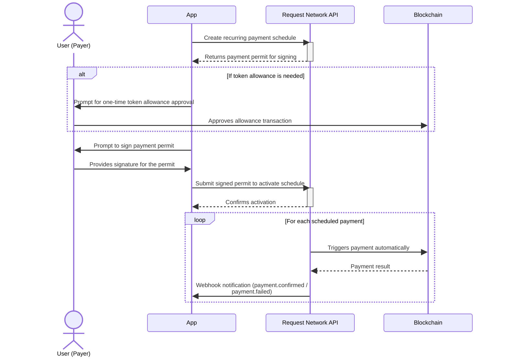

# Recurring payments


**Talk to an expert**

Discover how Request Network API can enhance your app's features - [book a call](https://meetings-eu1.hubspot.com/quentin-callec/request-network?utm_source=request.network\&utm_medium=docs\&utm_campaign=evergreen\&utm_content=book_a_demo_onpage) with us.


## Overview

The Recurring Payments feature allows you to create and manage subscription-like payments on the blockchain. The API handles the scheduling and triggering of these payments, providing a reliable way to automate regular transfers.

## Core functionality

* **Create Recurring Schedules:** Define a payment schedule with a start date, frequency (daily, weekly, monthly, yearly), and total number of payments. The system will generate a payment permit that encapsulates all the payment details.
* **Payer Authorization:** To authorize the payment series, the payer signs the payment permit with an EIP-712 signature. This single authorization allows the system to trigger all subsequent payments in the schedule without further interaction from the payer. For the first payment, the payer may also need to approve a token allowance for the recurring payment contract if they haven't already.
* **Automated Payments:** Once the payer has authorized the schedule, the Request Network API backend systems automatically trigger the payments at the specified intervals. You can rely on the API to handle the entire lifecycle of the recurring payments.
* **Status Tracking and Webhooks:** You can monitor the status of each recurring payment, including processed payments, failures, and completion status (e.g., active, paused, completed). Webhook notifications will be sent for key events like `payment.confirmed` and `payment.failed`, allowing your application to react in real time.
* **Flexible Management:** The API provides the ability to manage the lifecycle of a recurring payment. You can cancel a recurring payment schedule to stop future payments. If a payment fails (e.g., due to insufficient funds), the schedule will be paused, and you can unpause it once the issue is resolved. Unpausing a recurring payment once issues are resolved would allow the subscription to catch up on any missed payments.

## Security & Trust

Our recurring payments feature is built on a non-custodial smart contract that enforces several security measures to protect payers' funds and ensure predictable behavior. The core principle is that all payment parameters are defined upfront and cryptographically signed by the payer, preventing any unauthorized changes.

Here are some key security features provided by the smart contract:


* **Signature-Protected Payments:** Payments cannot be triggered without a valid EIP-712 signature from the payer. The smart contract verifies the signature for every payment attempt.
* **Immutable Recipient:** The recipient's address is part of the signed data. Funds can only be sent to this specified address, which cannot be altered after the schedule is authorized.
* **Fixed Payment Amount:** The amount for each payment is fixed in the signed permit. The smart contract will only transfer this exact amount, preventing any over- or under-payments.
* **Strict Payment Timing:** Payments cannot be triggered before their scheduled time. The contract calculates the due date for each payment and will reject any attempts to trigger it prematurely.
* **No-Repeat Payments:** The contract tracks payments, making it impossible to process the same payment more than once.
* **Enforced Payment Limit:** The total number of payments is defined in the signed permit. The smart contract enforces this limit and will not allow any extra payments beyond the agreed-upon total.
* **Sequential Payments:** Payments must be triggered in a strict, sequential order (e.g., payment #1, then #2, then #3). Any out-of-order attempt will fail, preventing missed or skipped payments from disrupting the schedule.
* **Signature Expiration:** Each recurring payment schedule has a `deadline`. If the signature expires, no further payments can be triggered, providing a hard stop for the agreement.

## Recurring payment workflow

The following diagram illustrates the typical flow for creating and managing recurring payments:




## Supported Networks

Recurring payments are supported on the following Blockchain networks:

* Ethereum
* Polygon
* Arbitrum
* Gnosis
* Base
* Binance Smart Chain
* Sepolia

## Supported currencies

The recurring payments support **all** **ERC20** currencies available in the supported networks.

See the full list here [supported-chains-and-currencies.md](supported-chains-and-currencies.md "mention")

## How it works

### 1.  Create a recurring payment

To enable recurring payments, a schedule must be created with the following endpoint:


[OpenAPI request-api](https://api.request.network/open-api/openapi.json)


The response includes a payment permit payload (EIP-712 typed data) for signature, and, if required, transactions for token allowance approval.

### 2. Payer authorization

The payer must:

* Approve the recurring payment contract to spend the required amount of tokens (if not already approved)
* Sign the payment permit using EIP-712 compatible wallet

**Example**

```javascript
import { Wallet, providers } from "ethers";

const privateKey = 'WALLET_PRIVATE_KEY'
const provider = const provider = new providers.JsonRpcProvider(
	"RPC_URL",
);

const wallet = new Wallet(privateKey, provider);

const recurringPaymentPermit = ... // from API response
const signature = await wallet._signTypedData(
  recurringPaymentPermit.domain,
  recurringPaymentPermit.types,
  recurringPaymentPermit.values
);

```

### 3. Recurring payment activation

To activate the recurring payment, the resulting signature must be submitted to the following endpoint:


[OpenAPI request-api](https://api.request.network/open-api/openapi.json)


A successful response confirms activation. The schedule is now active and payments will be executed automatically.

### 4. Status monitoring

The status, processed payments, next payment date, and other details can be retrieved at any time.


[OpenAPI request-api](https://api.request.network/open-api/openapi.json)


### 5. Recurring payment management

Recurring payments can be `cancelled` or `unpaused`.

* **Cancel**: stops all future payments
* **Unpause**: resume the recurring payment after it fails three times (due to insufficient balance or allowance)\



[OpenAPI request-api](https://api.request.network/open-api/openapi.json)

