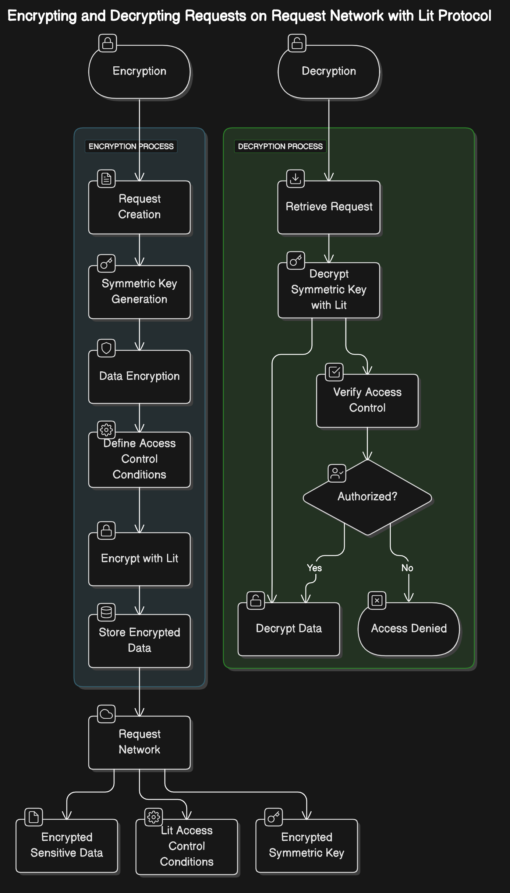

# Encrypt with a wallet signature using Lit Protocol

This document outlines how to encrypt and decrypt requests using Lit Protocol. Encryption and decryption are performed using the end-user's wallet signatures, ensuring only they can access the data. Neither Request Network nor Lit Protocol can access the data without consent from the user.&#x20;

This allows the end-user to own their data without requiring them to know about or manage their public key, as is the case when they [handling-encryption-with-the-js-library.md](handling-encryption-with-the-js-library.md "mention").&#x20;

Encryption with Lit Protocol supports the Add Stakeholder feature for adding view access to a 3rd party other than the payee or payer.

The LitCipherProvider is suitable for both frontend and backend use.

## Introduction

This implementation utilizes a two-step encryption process to secure sensitive data within requests:

1. Symmetric Encryption: The data is first encrypted using a randomly generated symmetric key (e.g., AES-256). This provides efficient encryption for larger data payloads.
2. Asymmetric Encryption with Lit Protocol: The symmetric key is then encrypted using Lit Protocol's decentralized key management network. Only authorized parties (payer and payee) can access the symmetric key and decrypt the data.


For a deeper introduction to Encryption and Decryption in Request Network, see [private-requests-using-encryption.md](../../get-started/protocol-overview/private-requests-using-encryption.md "mention")


## Benefits

* Ease-of-use: Encrypt using a signature instead of a public key.
* Efficiency: Symmetric encryption is efficient for large data, while Lit Protocol secures the key.
* Decentralized Access Control: Lit Protocol ensures that only authorized parties can decrypt the data.

## Architecture

The system consists of three main components:

* Request Network: Handles the creation, storage, and lifecycle of payment requests on the blockchain.
* Lit Protocol: Provides a decentralized key management network and encryption capabilities.
* Wallet Addresses: Used as the primary identifiers for access control in Lit Protocol.

<figure><figcaption></figcaption></figure>

## Workflow

### Encryption Process

1. Request Creation: The payer creates a request object using the Request Network SDK.
2. Symmetric Key Generation: A unique symmetric key is randomly generated.
3. Data Encryption: The payee and payer encrypt the sensitive data within the request using the generated symmetric key.
4. Encrypt Symmetric Key with Lit:
   * Define Access Control Conditions: The payee and payer define access control conditions using Lit Actions, specifying that only the Ethereum addresses of the payer and payee can decrypt the symmetric key.
   * Encrypt with Lit: The payee and payer encrypt the symmetric key using Lit's `encryptString` function, leveraging their wallet to sign the encryption.
5. Store Encrypted Data: The payee and payer store the following on the Request Network:
   * Encrypted request data
   * Lit access control conditions
   * Encrypted symmetric key

### Decryption Process

1. Retrieve Request: The payer and payee retrieve the following request data from the Request Network:
   1. Encrypted request data
   2. Lit access control conditions
   3. Encrypted symmetric key
2. Decrypt Symmetric Key with Lit: The payer and payee use Lit's `decryptString` function with their wallet to decrypt the encrypted symmetric key. Lit Protocol verifies the payer's and payee's addresses against access control conditions. If authorized, the symmetric key is decrypted.
3. Decrypt Data: The payer and payee use the decrypted symmetric key to decrypt the sensitive data.

## Installation

```bash
npm install @requestnetwork/lit-protocol-cipher @requestnetwork/request-client.js ethers@5.7.2
```

## Usage

```typescript
import { LitProtocolCipherProvider } from '@requestnetwork/lit-protocol-cipher';
import { RequestNetwork, Types } from '@requestnetwork/request-client.js';
import { LitNodeClient } from '@lit-protocol/lit-node-client';

// Node connection configuration
const nodeConnectionConfig = {
  baseURL: 'https://req-node.request.network',
  connectionTimeout: 10000,
  retry: {
    retries: 3
  }
};

// Initialize Lit Node Client
const litClient = new LitNodeClient({
  litNetwork: 'datil',
  debug: false
});

// Initialize the Lit Provider
const litProvider = new LitProtocolCipherProvider(
  litClient,
  nodeConnectionConfig,
  'ethereum' // optional chain parameter
);

// Connect to Lit Network
await litProvider.initializeClient();

// Initialize wallet and get session signatures
const wallet = new Wallet('your-private-key');
const address = await wallet.getAddress();

// Get session signatures
await litProvider.getSessionSignatures(wallet, address);

// Enable decryption
litProvider.enableDecryption(true);

// Initialize Request Network
const requestNetwork = new RequestNetwork({
  cipherProvider: litProvider,
  signatureProvider: new Web3SignatureProvider(wallet),
  nodeConnectionConfig
});
```

#### Creating Encrypted Requests

```typescript
const payeeIdentity = {
  type: Types.Identity.TYPE.ETHEREUM_ADDRESS,
  value: 'payee-ethereum-address'
};

const payerIdentity = {
  type: Types.Identity.TYPE.ETHEREUM_ADDRESS,
  value: 'payer-ethereum-address'
};

// Define encryption parameters
const encryptionParams = [
  {
    key: payeeIdentity.value,
    method: Types.Encryption.METHOD.KMS
  },
  {
    key: payerIdentity.value,
    method: Types.Encryption.METHOD.KMS
  }
];

// Create request parameters
const requestCreateParameters = {
  requestInfo: {
    currency: {
      type: Types.RequestLogic.CURRENCY.ERC20,
      value: '0x370DE27fdb7D1Ff1e1BaA7D11c5820a324Cf623C',
      network: 'sepolia',
    },
    expectedAmount: '1000000000000000000',
    payee: payeeIdentity,
    payer: payerIdentity,
    timestamp: Utils.getCurrentTimestampInSecond(),
  },
  paymentNetwork: {
    id: Types.Extension.PAYMENT_NETWORK_ID.ERC20_FEE_PROXY_CONTRACT,
    parameters: {
      paymentNetworkName: 'sepolia',
      paymentAddress: payeeIdentity.value,
      feeAddress: '0x0000000000000000000000000000000000000000',
      feeAmount: '0',
    },
  },
  contentData: {
    reason: '🍕',
    dueDate: '2023.06.16',
  },
  signer: payeeIdentity,
};

// Create the encrypted request
const request = await requestNetwork._createEncryptedRequest({
  requestParameters: requestCreateParameters,
  encryptionParams
});
```

#### Decrypting Requests

```typescript
// Fetch an existing request
const requestId = "request_id_here";
const request = await requestNetwork.fromRequestId(requestId);

// If you have the correct permissions (wallet address in encryption params),
// and decryption is enabled, the data will be automatically decrypted
const requestData = await request.getData();

// The decrypted data will include:
console.log({
  requestInfo: requestData.requestInfo,
  paymentNetwork: requestData.paymentNetwork,
  contentData: requestData.contentData,
  state: requestData.state
});
```

#### Disable Decryption

```typescript
// Disable decryption
litProvider.enableDecryption(false)
```

#### Decryption Requirements

1. The wallet address must be included in the original encryption parameters
2. Session signatures must be valid
3. Decryption must be enabled
4. The Lit Protocol client must be connected

#### Cleanup

```typescript
// Proper cleanup sequence
try {
  // First disconnect the wallet
  await litProvider.disconnectWallet();
  
  // Then disconnect the client
  await litProvider.disconnectClient();
} catch (error) {
  console.error('Cleanup error:', error);
}
```

### ICipherProvider Interface

```typescript
interface ICipherProvider {
  encrypt(data: any, options: any): Promise<any>;
  decrypt(encryptedData: any, options: any): Promise<any>;
  isEncryptionAvailable(): boolean;
  isDecryptionAvailable(): boolean;
  enableDecryption(option: boolean): void;
  isDecryptionEnabled(): boolean;
}
```
